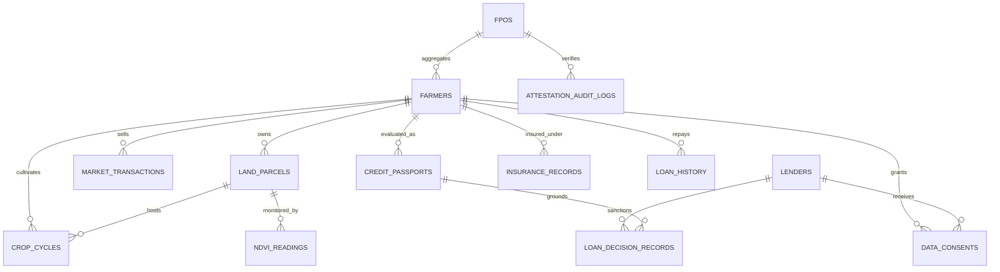
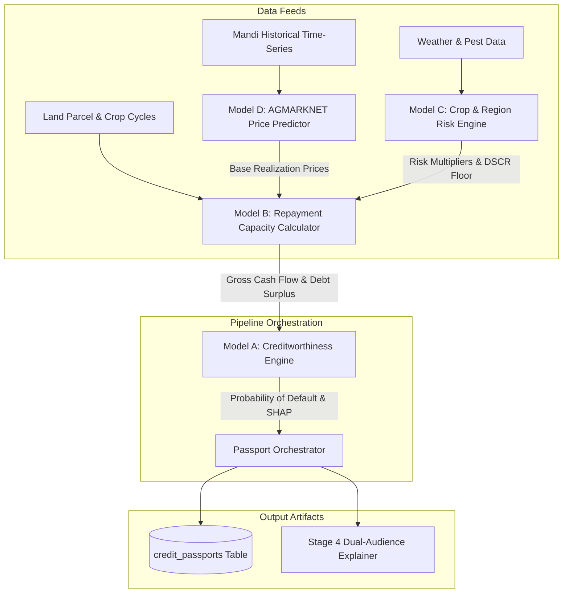
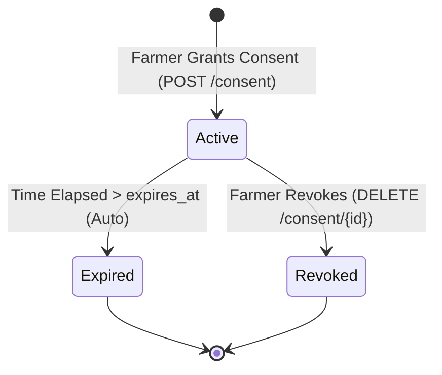
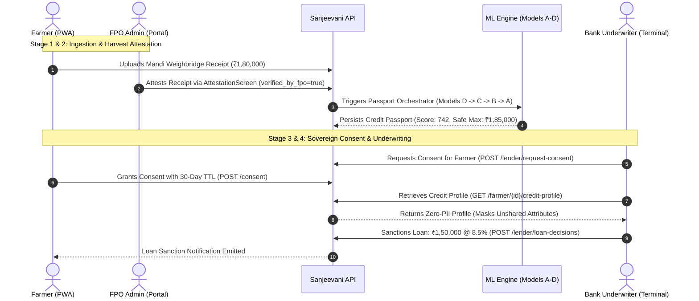

# 🌾 SANJEEVANI — MASTER SYSTEM SPECIFICATION & ARCHITECTURAL BLUEPRINT
## Complete Reference for Google Stitch, Platform Builders & AI Systems

> **System Name:** Sanjeevani (formerly KisanCred / AgriTrust)  
> **Classification:** Alternate-Data Agricultural Credit Intelligence & Sovereign Consent Platform  
> **Version:** 1.0.0-PROD (Pilot-Ready)  
> **Target Production Date:** 2026  
> **Regulatory Architecture:** DPDP Act 2023 (Digital Personal Data Protection) Compliant  

---

## TABLE OF CONTENTS
1. [Executive System Overview & Core Innovation](#1-executive-system-overview--core-innovation)
2. [Complete Codebase File & Folder Manifest](#2-complete-codebase-file--folder-manifest)
3. [Configuration & Environment Variable Matrix](#3-configuration--environment-variable-matrix)
4. [PostgreSQL + PostGIS Database Architecture & Entity Specifications](#4-postgresql--postgis-database-architecture--entity-specifications)
5. [Multi-Source Data Ingestion Engine & SLA Telemetry](#5-multi-source-data-ingestion-engine--sla-telemetry)
6. [Quad-Model Machine Learning Engine & Scoring Orchestration](#6-quad-model-machine-learning-engine--scoring-orchestration)
7. [Dual-Audience Plain-Language Explainability Layer](#7-dual-audience-plain-language-explainability-layer)
8. [Sovereign Consent Framework & Zero-PII Security Backbone](#8-sovereign-consent-framework--zero-pii-security-backbone)
9. [Exhaustive REST API Specification (FastAPI)](#9-exhaustive-rest-api-specification-fastapi)
10. [Frontend Applications & UI/UX Design System](#10-frontend-applications--uiux-design-system)
11. [End-to-End System Workflows & Sequence Lifecycles](#11-end-to-end-system-workflows--sequence-lifecycles)
12. [Deployment Infrastructure, Docker Compose & Runtime Launchers](#12-deployment-infrastructure-docker-compose--runtime-launchers)
13. [Test Suite, Quality Assurance & Pilot Data Fixtures](#13-test-suite-quality-assurance--pilot-data-fixtures)

## 1. EXECUTIVE SYSTEM OVERVIEW & CORE INNOVATION

### 1.1 The Core Problem
Over **120 million smallholder farmers across India** remain excluded from formal banking credit due to the absence of traditional CIBIL scores, formal payslips, or documented collateral. When rural farmers apply for bank loans or Kisan Credit Cards (KCC), traditional financial institutions face high underwriting friction, prohibitive manual verification costs, and extreme information asymmetry. Consequently, farmers are forced into usurious debt from unorganized local moneylenders charging interest rates between 36% and 60% p.a.

### 1.2 The Sanjeevani Solution
**Sanjeevani** bridges this credit divide by constructing a sovereign, alternate-data **Agricultural Credit Intelligence Engine**. Sanjeevani triangulates hyper-local agronomic, satellite, market, insurance, and cooperative data to generate an institutional-grade **Credit Passport** featuring:
- **AgriTrust Score (300–900 scale):** Calibrated creditworthiness metric derived from alternate agricultural data.
- **Data Confidence Metric (0.00 to 1.00 / 0% to 100%):** Dynamic reliability indicator based on the freshness and completeness of ingestion feeds.
- **Safe Credit Boundaries (`safe_credit_min` to `safe_credit_max` in INR):** Cash-flow-derived borrowing floor and ceiling that prevents over-indebtedness.
- **Dual-Audience Explanations:** Real-time synthesis via IBM Granite 3 8B Instruct providing vernacular actionable advice for farmers and formal credit memoranda for bank underwriters.
- **Sovereign Consent Gating:** Farmers maintain absolute ownership over their data; lenders can only inspect permitted attributes with active, time-bound consent tokens.

### 1.3 System Roles & Personas
1. **Smallholder Farmers:** Access their digital passbook via an offline-first Progressive Web App (Port 3000), toggle consent for specific lenders, view credit scores, and upload crop receipts.
2. **Farmer Producer Organizations (FPOs):** Cooperative managers access an administrative hub (Port 3001) to monitor aggregate member risk, attest harvest weighbridge deliveries, and negotiate bulk low-interest group financing.
3. **Institutional Lenders (Banks / NBFCs):** Credit risk officers and underwriters use an institutional terminal (Port 3002) to search consent-granted farmers, evaluate cash flow projections and downside Mandi prices, and record formal loan sanctions.
4. **Platform DevOps & Agronomists:** Operations teams monitor real-time ingestion freshness, connector SLAs, and model drift via the Ingestion Health Dashboard (`/api/v1/health/ingestion-dashboard`).

## 2. COMPLETE CODEBASE FILE & FOLDER MANIFEST

Below is an exhaustive, annotated breakdown of every directory and file in the Sanjeevani platform:

```
c:\Users\Shivam Ray\Desktop\IBM\
├── backend/                           # FastAPI Core REST API & PostGIS Backend Subsystem
│   ├── alembic/                       # Alembic Database Migration System
│   │   ├── env.py                     # Async/sync Alembic migration environment config
│   │   ├── script.py.mako             # Migration template script
│   │   └── versions/                  # Database migration revisions
│   ├── app/                           # Main Application Package
│   │   ├── api/                       # API Route Declarations
│   │   │   └── v1/                    # API Version 1
│   │   │       ├── endpoints/         # Modular Endpoint Handlers
│   │   │       │   ├── auth.py        # OAuth2 password bearer & JWT authentication
│   │   │       │   ├── consent.py     # Sovereign consent issuance, validation, revocation
│   │   │       │   ├── credit.py      # Credit profile retrieval, passport generation
│   │   │       │   ├── demo.py        # Demonstration showcase hub & live pipeline runner
│   │   │       │   ├── fpo.py         # FPO portfolio aggregate, member list, attestation
│   │   │       │   ├── health.py      # Liveness, readiness, and ingestion freshness
│   │   │       │   ├── ingestion.py   # Multi-source ingestion triggers & run logs
│   │   │       │   ├── lender.py      # Lender portfolio search, underwriting, decision log
│   │   │       │   └── __init__.py    # Endpoints package init
│   │   │       ├── router.py          # Master API v1 router mounting all 8 sub-routers
│   │   │       └── __init__.py        # v1 package init
│   │   ├── core/                      # System Configurations & Utilities
│   │   │   ├── config.py              # Pydantic Settings loaded from .env
│   │   │   ├── logging_config.py      # Structured JSON formatter for production logging
│   │   │   ├── security.py            # Password hashing (bcrypt) & JWT token handling
│   │   │   └── __init__.py            # Core package init
│   │   ├── db/                        # Database Sessions & Fixtures
│   │   │   ├── base.py                # DeclarativeBase import registry for Alembic
│   │   │   ├── seed.py                # Database population script with Nashik pilot data
│   │   │   ├── session.py             # Async & sync SQLAlchemy engine/sessionmaker
│   │   │   └── __init__.py            # DB package init
│   │   ├── ingestion/                 # Multi-Source Ingestion Engine (Stage 2)
│   │   │   ├── agmarknet_ingestor.py  # AGMARKNET APMC Mandi price arrival scraper
│   │   │   ├── base.py                # Abstract BaseIngestor & IngestionResult dataclass
│   │   │   ├── celery_app.py          # Celery worker & Redis broker setup
│   │   │   ├── fpo_erp_ingestor.py    # FPO weighbridge harvest delivery connector
│   │   │   ├── land_gis_ingestor.py   # Cadastral land parcel GIS & 7/12 parser
│   │   │   ├── pmfby_ingestor.py      # PM Fasal Bima Yojana crop insurance connector
│   │   │   ├── remote_sensing_ingestor.py # Sentinel-2 satellite NDVI/NDWI ingestion
│   │   │   ├── tasks.py               # Celery asynchronous periodic tasks
│   │   │   └── __init__.py            # Ingestion package init
│   │   ├── models/                    # SQLAlchemy ORM Data Models (Stage 0 & 1)
│   │   │   ├── attestation_audit.py   # Immutable audit log for FPO harvest verifications
│   │   │   ├── base.py                # Base SQLAlchemy declarative class
│   │   │   ├── credit_passport.py     # Calibrated credit passport & safe credit limits
│   │   │   ├── crop_cycle.py          # Historical and current crop planting/yield records
│   │   │   ├── data_consent.py        # Sovereign consent tokens, scopes, and expirations
│   │   │   ├── data_ingestion_log.py  # Run metrics (rows, duration, SLA) for connectors
│   │   │   ├── farmer.py              # Farmer identities with SHA-256 hashed Aadhaar
│   │   │   ├── fpo.py                 # Farmer Producer Organizations cooperative entities
│   │   │   ├── input_cost.py          # Regional cost of cultivation benchmarks per acre
│   │   │   ├── insurance_record.py    # PMFBY insurance coverage and claim histories
│   │   │   ├── land_parcel.py         # PostGIS GEOMETRY(Polygon, 4326) plot boundaries
│   │   │   ├── lender.py              # Financial institutions (Banks, NBFCs, MFIs)
│   │   │   ├── loan_decision.py       # Formal underwriting loan sanction decision log
│   │   │   ├── loan_history.py        # Prior credit obligations, repayment behavior
│   │   │   ├── market_price.py        # Mandi price time-series (min, max, modal prices)
│   │   │   ├── market_transaction.py  # Historical sale receipts and weighbridge slips
│   │   │   ├── ndvi_reading.py        # Sentinel-2 biomass indices (NDVI, NDWI, EVI)
│   │   │   ├── pest_disease_index.py  # Regional agronomic pest and infestation severity
│   │   │   └── __init__.py            # Models package init
│   │   ├── schemas/                   # Pydantic Request/Response Models
│   │   │   ├── auth.py                # Token, TokenPayload, LoginRequest schemas
│   │   │   ├── consent.py             # ConsentCreate, ConsentResponse, ConsentFilter
│   │   │   ├── credit_profile.py      # CreditProfileResponse, PassportCreate, RiskProfile
│   │   │   ├── fpo.py                 # FPOSummary, MemberItem, AttestRequest, BulkTerms
│   │   │   ├── health.py              # HealthResponse, ServiceStatus, FreshnessMetric
│   │   │   ├── lender.py              # PortfolioSearchFilter, LoanDecisionRequest
│   │   │   └── __init__.py            # Schemas package init
│   │   ├── services/                  # Business Logic Services
│   │   │   ├── explanation.py         # Service bridge connecting FastAPI to ML explainer
│   │   │   └── __init__.py            # Services package init
│   │   ├── main.py                    # FastAPI ASGI application entrypoint & middleware
│   │   └── __init__.py                # App package init
│   ├── tests/                         # Backend Unit & Integration Tests (92 passing)
│   │   ├── conftest.py                # Pytest fixtures, mock DB sessions, test client
│   │   ├── test_health.py             # Liveness, readiness, and freshness endpoint tests
│   │   ├── test_ingestion.py          # Multi-source connector & audit log tests
│   │   ├── test_pilot_end_to_end.py   # Complete 6-stage end-to-end integration tests
│   │   ├── test_schema.py             # Database model constraint & PostGIS tests
│   │   ├── test_stage4_explanation.py # Dual-audience plain-language explanation tests
│   │   ├── test_stage5_api.py         # Consent issuance, masking, and revocation tests
│   │   ├── test_stage7_fpo_api.py     # FPO portfolio summary & attestation tests
│   │   ├── test_stage8_lender_api.py  # Lender portfolio search & decision log tests
│   │   └── __init__.py                # Tests package init
│   ├── alembic.ini                    # Alembic migration configuration file
│   ├── Dockerfile                     # Production container build for backend service
│   └── requirements.txt               # Backend Python package dependencies
├── ml-engine/                         # Machine Learning Pipeline & Explainability Engine
│   ├── explanation/                   # Stage 4 Explainability Subsystem
│   │   ├── engine.py                  # ExplanationEngine & dual-audience synthesis logic
│   │   ├── prompts.py                 # Prompt templates for Farmer advice & Lender notes
│   │   ├── providers.py               # IBM WatsonX Granite 3 8B, OpenAI & Rule fallbacks
│   │   └── __init__.py                # Explanation package init
│   ├── pipelines/                     # Machine Learning Scoring Models
│   │   ├── base_model.py              # Abstract BaseModel with versioning & telemetry
│   │   ├── credit_scoring.py          # Classical statistical credit risk baseline
│   │   ├── feature_store.py           # Feature extraction & vector caching
│   │   ├── model_a_creditworthiness.py# Model A: PD, AgriTrust Score & TreeSHAP
│   │   ├── model_b_repayment_capacity.py # Model B: Cash Flow & Safe Borrowing Limits
│   │   ├── model_c_crop_risk.py       # Model C: Weather Anomaly & Agronomic Risk
│   │   ├── model_d_price_predictor.py # Model D: AGMARKNET Mandi Price Realizations
│   │   ├── passport_orchestrator.py   # Master pipeline runner orchestrating Models D->C->B->A
│   │   ├── yield_forecasting.py       # Satellite biomass yield projection model
│   │   └── __init__.py                # Pipelines package init
│   ├── tests/                         # ML Model Tests
│   │   ├── conftest.py                # ML test fixtures & mock feature stores
│   │   ├── test_cashflow_model.py     # Repayment capacity & DSCR tests
│   │   ├── test_climate_model.py      # Crop risk & weather anomaly tests
│   │   ├── test_explanation_layer.py  # Prompt generation & provider tests
│   │   ├── test_mandi_model.py        # 3-scenario price forecasting tests
│   │   ├── test_ml_pipeline.py        # End-to-end ML orchestration tests
│   │   ├── test_passport_orchestrator.py # Multi-model pipeline orchestration tests
│   │   ├── test_scoring_models.py     # Model A weights, calibration, and tiers
│   │   ├── test_shap_explainer.py     # TreeSHAP feature importance validation
│   │   ├── test_training_pipeline.py  # Model retraining & validation loop tests
│   │   ├── test_underwriting_rules.py # Policy rule boundary checks
│   │   └── __init__.py                # ML tests package init
│   ├── tracking/                      # Experiment Tracking Subsystem
│   │   ├── mlflow_config.py           # MLflow tracking server setup & metric logging
│   │   └── __init__.py                # Tracking package init
│   ├── Dockerfile                     # Container build for standalone ML worker
│   ├── evaluate_models.py             # Model performance benchmarking (AUC, KS, RMSE)
│   ├── mlflow.db                      # Local SQLite backend for MLflow runs
│   ├── README.md                      # ML engine documentation
│   ├── requirements.txt               # ML dependencies (xgboost, shap, scikit-learn)
│   └── worker.py                      # Celery worker process executing ML scoring jobs
├── frontend-farmer-pwa/               # Farmer Progressive Web App (React 18 + Vite)
│   ├── public/                        # Static Assets
│   │   ├── icon.svg                   # PWA agricultural logo icon
│   │   ├── manifest.json              # Web App Manifest for mobile installability
│   │   └── sw.js                      # Offline caching Service Worker
│   ├── src/                           # Source Code
│   │   ├── components/                # Reusable UI Components
│   │   │   ├── BottomNav.jsx          # Mobile bottom navigation bar (5 screens)
│   │   │   ├── LanguagePicker.jsx     # Multilingual selector (English, Hindi, Marathi)
│   │   │   ├── OfflineBanner.jsx      # Network disconnection & offline status banner
│   │   │   ├── ProfileCompleteness.jsx# Visual progress bar for data confidence
│   │   │   ├── SafeBorrowingCard.jsx  # Card displaying min/max borrowing limits
│   │   │   └── ScoreGauge.jsx         # Radial SVG visual gauge (0–100 scale)
│   │   ├── i18n/                      # Internationalization Subsystem
│   │   │   ├── LanguageContext.jsx    # React Context provider for current language
│   │   │   └── translations.js        # Complete translation dictionaries (EN, HI, MR)
│   │   ├── screens/                   # Top-Level Screen Views
│   │   │   ├── ConsentManagerScreen.jsx # Sovereign consent toggle & scope manager
│   │   │   ├── DashboardScreen.jsx    # Main screen with gauge, safe limits, metrics
│   │   │   ├── DataUploadScreen.jsx   # Photo upload for crop sales & insurance
│   │   │   ├── FPOMembershipScreen.jsx# FPO cooperative profile & member standing
│   │   │   └── InsightsScreen.jsx     # Actionable plain-language explanations
│   │   ├── services/                  # Client Services
│   │   │   ├── api.js                 # Axios client communicating with Stage 5 API
│   │   │   └── offlineQueue.js        # LocalStorage/IndexedDB queue for offline sync
│   │   ├── styles/                    # Stylesheets
│   │   │   └── pwa.css                # Mobile-first CSS with dark theme tokens
│   │   ├── App.jsx                    # Root component with screen routing
│   │   ├── main.jsx                   # React DOM entrypoint
│   │   └── serviceWorkerRegistration.js # Service worker registration lifecycle
│   ├── index.html                     # HTML5 shell with viewport & PWA meta tags
│   ├── package.json                   # Node dependencies & preview scripts (Port 3000)
│   └── vite.config.js                 # Vite build configuration
├── frontend-fpo-portal/               # FPO Cooperative Administration Hub (React + Vite)
│   ├── src/                           # Source Code
│   │   ├── components/                # Reusable UI Components
│   │   │   ├── MemberPassportModal.jsx# Modal inspecting individual member passport
│   │   │   ├── RiskMixBar.jsx         # Tri-color stacked bar (Low/Moderate/High risk)
│   │   │   ├── ScoreHistogram.jsx     # Distribution chart of member credit scores
│   │   │   └── TopNav.jsx             # Cooperative header & navigation bar
│   │   ├── screens/                   # Portal Screens
│   │   │   ├── AttestationScreen.jsx  # Harvest weighbridge slip verification workflow
│   │   │   ├── BulkFinancingScreen.jsx# Aggregated loan negotiation terms for banks
│   │   │   ├── MemberManagementScreen.jsx # Member directory, search, data flags
│   │   │   └── PortfolioOverviewScreen.jsx# Cooperative macro portfolio dashboard
│   │   ├── services/                  # API Services
│   │   │   └── api.js                 # Client for FPO API endpoints
│   │   ├── styles/                    # Stylesheets
│   │   │   └── portal.css             # Administrative dashboard layout & glassmorphism
│   │   ├── App.jsx                    # Root component with 4 portal tabs
│   │   └── main.jsx                   # React DOM mount point
│   ├── index.html                     # HTML5 entry shell
│   ├── package.json                   # Dependencies & preview scripts (Port 3001)
│   └── vite.config.js                 # Vite configuration
├── frontend-lender-dashboard/         # Institutional Bank Underwriting Terminal (React + Vite)
│   ├── src/                           # Source Code
│   │   ├── components/                # Reusable UI Components
│   │   │   ├── CashFlowChart.jsx      # Seasonal revenue vs cost monthly projections
│   │   │   ├── ConsentBadgeIndicator.jsx # Visual badge showing active consent & expiry
│   │   │   ├── CropRiskMatrix.jsx     # Agronomic & climate risk breakdown card
│   │   │   ├── DecisionModal.jsx      # Sanction recording form (amount, interest, covenants)
│   │   │   ├── PriceScenarioChart.jsx # AGMARKNET 3-scenario realizations bar chart
│   │   │   └── TopNav.jsx             # Institutional bank header & underwriter profile
│   │   ├── screens/                   # Terminal Screens
│   │   │   ├── ConsentRequestScreen.jsx # Interface for lenders to request farmer consent
│   │   │   ├── FarmerDetailScreen.jsx # Comprehensive underwriting dossier (Zero-PII)
│   │   │   ├── LoanDecisionLogScreen.jsx # Historical audit log of underwriter decisions
│   │   │   └── PortfolioSearchScreen.jsx # Consent-gated search & filter catalog
│   │   ├── services/                  # API Services
│   │   │   └── api.js                 # Client for Stage 5 & 8 lender API endpoints
│   │   ├── styles/                    # Stylesheets
│   │   │   └── lender.css             # High-density financial terminal CSS
│   │   ├── App.jsx                    # Root terminal component
│   │   └── main.jsx                   # React DOM mount point
│   ├── index.html                     # HTML5 shell
│   ├── package.json                   # Dependencies & preview scripts (Port 3002)
│   └── vite.config.js                 # Vite configuration
├── packages/                          # Monorepo Shared Libraries
│   └── shared-ui/                     # Shared UI Component Library
│       ├── src/                       # Shared React Components
│       │   ├── components/            # Button, Card, Badge, ConsentBadge, StatWidget
│       │   ├── styles/tokens.css      # Shared design tokens (colors, typography, shadows)
│       │   └── index.js               # Library exports
│       └── package.json               # Package configuration
├── scripts/                           # Operational, Pilot & Demonstration Scripts
│   ├── pilot_onboard.py               # Pilot onboarding CLI (generates GeoJSON & CSVs)
│   ├── run_pilot_pipeline.py          # End-to-end CLI demonstrating 6 pipeline stages
│   └── start_all.py                   # Unified runtime launcher for all 4 services
├── docs/                              # Architectural & Deployment Documentation
│   ├── API_SPEC.md                    # REST API endpoint specifications
│   ├── ARCHITECTURE.md                # System architecture & component mapping
│   ├── CONSENT_MECHANISM.md           # Sovereign consent state machine & rules
│   ├── pilot_deployment.md            # Single-FPO deployment runbook & cloud roadmap
│   ├── PRD_TEMPLATE.json              # Product requirements document schema
│   └── SCHEMA_ERD.md                  # Database schema & Mermaid ER diagram
├── data/                              # Test Datasets & Pilot Fixtures
│   ├── pilot_onboarding/              # Generated Nashik Pilot Data
│   │   ├── NSK-FPO-01_crop_cycles.csv # 150 seasonal crop cycles
│   │   ├── NSK-FPO-01_farmers.csv     # 150 farmer profiles with hashed Aadhaar
│   │   ├── NSK-FPO-01_land_parcels.geojson # 150 spatial land parcel polygons
│   │   └── NSK-FPO-01_onboarding_summary.json # Summary metrics of onboarding run
│   ├── data_loader.py                 # Utility for loading tabular & GIS test data
│   └── sample.csv                     # Sample multi-crop transaction data
├── infra/                             # Infrastructure Configurations
│   ├── docker/                        # Container Initialization
│   │   ├── init-postgis.sql           # PostGIS extensions & table bootstrap
│   │   ├── redis.conf                 # Redis persistence & eviction policy
│   │   └── seed-data.sql              # Seed SQL fixture populating 25 farmers
│   └── .env.docker                    # Containerized environment defaults
├── gateway/                           # Multi-Channel Gateway Adapters
│   ├── adapters/                      # Channel adapters (API, Web, WhatsApp)
│   ├── static/index.html              # Multi-channel web test interface
│   └── app.py                         # Gateway ASGI routing application
├── verticals/                         # Domain Specialization Templates
│   ├── agriculture.json               # Agri-domain scoring features & weights
│   ├── business.json                  # MSME trade credit configuration
│   ├── education.json                 # Student loan underwriting template
│   └── healthcare.json                # Medical financing risk configuration
├── docker-compose.yml                 # Multi-container orchestration stack
├── package.json                       # Root monorepo workspace configuration
├── package-lock.json                  # NPM locked dependencies
├── pytest.ini                         # Pytest configuration & test markers
├── README.md                          # Repository overview & quickstart guide
├── requirements.txt                   # Root Python dependencies
├── start_sanjeevani.bat               # One-click Windows batch launcher
├── start_sanjeevani.ps1               # One-click Windows PowerShell launcher
└── GOOGLE_STITCH_BLUEPRINT.md         # This Master Specification Document
```
---

## 3. CONFIGURATION & ENVIRONMENT VARIABLE MATRIX

Every environment variable in the Sanjeevani platform is strongly typed via Pydantic in `backend/app/core/config.py`:

| Variable Name | Type | Default Value | Description |
|---|---|---|---|
| `PROJECT_NAME` | `str` | `Sanjeevani API` | Display name of the platform service |
| `VERSION` | `str` | `0.1.0` | Semantic version of the running codebase |
| `API_V1_STR` | `str` | `/api/v1` | Global prefix for all Version 1 API endpoints |
| `ENVIRONMENT` | `str` | `development` | Deployment environment (`development`, `staging`, `production`) |
| `DEBUG` | `bool` | `True` | Enables Swagger UI, debug logs, and detailed stack traces |
| `CORS_ORIGINS` | `List[str]` | `["http://localhost:3000", "http://localhost:3001", "http://localhost:3002", "http://localhost:5173", ...]` | Allowed Cross-Origin Resource Sharing origins |
| `POSTGRES_USER` | `str` | `sanjeevani` | PostgreSQL database master username |
| `POSTGRES_PASSWORD` | `str` | `sanjeevani_secret` | PostgreSQL database user password |
| `POSTGRES_DB` | `str` | `sanjeevani_db` | Target PostgreSQL database name |
| `POSTGRES_HOST` | `str` | `localhost` (or `postgres` in Docker) | Database server hostname or container alias |
| `POSTGRES_PORT` | `int` | `5432` | Database port |
| `DATABASE_URL` | `str` | `postgresql+asyncpg://...` | Asynchronous SQLAlchemy connection string |
| `SYNC_DATABASE_URL` | `str` | `postgresql://...` | Synchronous SQLAlchemy connection string for migrations & ML |
| `REDIS_HOST` | `str` | `localhost` (or `redis` in Docker) | Redis broker host |
| `REDIS_PORT` | `int` | `6379` | Redis broker port |
| `REDIS_URL` | `str` | `redis://localhost:6379/0` | Connection string for Celery and caching |
| `JWT_SECRET_KEY` | `str` | `super_secret_jwt_key_for_sanjeevani_platform_2026` | HMAC SHA-256 signing secret for user authentication |
| `JWT_ALGORITHM` | `str` | `HS256` | JWT signature encryption algorithm |
| `ACCESS_TOKEN_EXPIRE_MINUTES` | `int` | `60` | User session token validity window |
| `REFRESH_TOKEN_EXPIRE_DAYS` | `int` | `7` | Long-lived refresh token validity window |
| `CONSENT_SECRET_KEY` | `str` | `consent_master_secret_hmac_key_2026` | Secret key used to sign sovereign consent tokens |
| `CONSENT_DEFAULT_TTL_DAYS` | `int` | `30` | Default validity period for granted data consents |
| `EXPLANATION_LLM_PROVIDER` | `str` | `watsonx` | LLM engine (`watsonx`, `openai`, `mock`) |
| `IBM_WATSONX_APIKEY` | `str` | `""` | IBM Cloud API key for watsonx.ai |
| `IBM_WATSONX_PROJECT_ID` | `str` | `""` | IBM watsonx.ai project identifier |
| `IBM_WATSONX_URL` | `str` | `https://us-south.ml.cloud.ibm.com` | IBM Cloud watsonx inference URL |
| `IBM_WATSONX_MODEL_ID` | `str` | `ibm/granite-3-8b-instruct` | IBM Foundation model ID |
| `OPENAI_API_KEY` | `str` | `""` | OpenAI API key for fallback inference |
| `OPENAI_MODEL_ID` | `str` | `gpt-4o-mini` | Fallback OpenAI model identifier |
| `OPENAI_BASE_URL` | `str` | `https://api.openai.com/v1` | OpenAI API compatible base URL |

---

## 4. POSTGRESQL + POSTGIS DATABASE ARCHITECTURE & ENTITY SPECIFICATIONS

The relational and spatial database schema consists of **18 strongly typed tables** adhering to 3NF standards, strict foreign key referential integrity (`ON DELETE RESTRICT` for audit compliance), and PostGIS spatial indexing.

### 4.1 Master Entity-Relationship Overview


### 4.2 Comprehensive Table Specifications

#### Table 1: `fpos` (Farmer Producer Organizations)
- `fpo_id` (`UUID`, PK, default `uuid_generate_v4()`)
- `fpo_name` (`VARCHAR(255)`, NOT NULL) — e.g. "Sahyadri Farmers Producer Co. Ltd."
- `registration_number` (`VARCHAR(100)`, UNIQUE, NOT NULL) — Official cooperative or MCA registration
- `region` (`VARCHAR(150)`, NOT NULL) — District and State (e.g. "Nashik, Maharashtra")
- `member_count` (`INTEGER`, default 0) — Active registered farmer base
- `created_at` (`TIMESTAMPTZ`, default `now()`)
- `updated_at` (`TIMESTAMPTZ`, default `now()`)

#### Table 2: `lenders` (Institutional Financial Entities)
- `lender_id` (`UUID`, PK, default `uuid_generate_v4()`)
- `institution_name` (`VARCHAR(255)`, NOT NULL) — e.g. "State Bank of India (Agri-Business)"
- `api_key_hash` (`VARCHAR(64)`, NOT NULL) — SHA-256 hash of lender credential
- `tier` (`VARCHAR(50)`, NOT NULL) — `Tier-1 Public Bank`, `Private Bank`, `NBFC`, `MFI`
- `created_at` (`TIMESTAMPTZ`, default `now()`)
- `updated_at` (`TIMESTAMPTZ`, default `now()`)

#### Table 3: `farmers` (Smallholder Farmer Identities)
- `farmer_id` (`UUID`, PK, default `uuid_generate_v4()`)
- `aadhaar_hash` (`VARCHAR(64)`, UNIQUE, NOT NULL) — **Zero-PII Invariant:** One-way SHA-256 hash of the 12-digit Aadhaar. Raw plaintext Aadhaar is never persisted.
- `full_name` (`VARCHAR(150)`, NOT NULL) — Legal farmer name
- `mobile_number` (`VARCHAR(15)`, UNIQUE, NOT NULL) — 10-digit mobile number
- `fpo_id` (`UUID`, FK `fpos.fpo_id`, ON DELETE SET NULL)
- `is_active` (`BOOLEAN`, default TRUE) — Soft deletion flag
- `is_archived` (`BOOLEAN`, default FALSE) — Regulatory archival flag
- `created_at` (`TIMESTAMPTZ`, default `now()`)
- `updated_at` (`TIMESTAMPTZ`, default `now()`)

#### Table 4: `land_parcels` (PostGIS Spatial Cadastral Plots)
- `parcel_id` (`UUID`, PK, default `uuid_generate_v4()`)
- `farmer_id` (`UUID`, FK `farmers.farmer_id`, ON DELETE RESTRICT)
- `survey_number` (`VARCHAR(50)`, NOT NULL) — Official land revenue 7/12 plot number
- `acreage` (`NUMERIC(10, 2)`, NOT NULL) — Area in acres
- `soil_type` (`VARCHAR(50)`) — `Black Cotton`, `Red Loam`, `Alluvial`, `Sandy Loam`
- `irrigation_source` (`VARCHAR(50)`) — `Drip & Canal`, `Borewell`, `Rainfed`, `Solar Pump`
- `boundary_polygon` (`GEOMETRY(Polygon, 4326)`, NOT NULL) — Spatial polygon boundaries in WGS84 coordinates. Indexed via **GIST Index** (`idx_land_parcels_boundary_polygon_gist`).
- `created_at` (`TIMESTAMPTZ`, default `now()`)
- `updated_at` (`TIMESTAMPTZ`, default `now()`)

#### Table 5: `crop_cycles` (Seasonal Agricultural Production)
- `cycle_id` (`UUID`, PK, default `uuid_generate_v4()`)
- `farmer_id` (`UUID`, FK `farmers.farmer_id`, ON DELETE RESTRICT)
- `parcel_id` (`UUID`, FK `land_parcels.parcel_id`, ON DELETE RESTRICT)
- `crop_name` (`VARCHAR(100)`, NOT NULL) — e.g. "Soybean", "Thompson Grapes", "Red Onion"
- `season` (`VARCHAR(50)`, NOT NULL) — e.g. "Kharif 2025", "Rabi 2025-26"
- `expected_yield` (`NUMERIC(10, 2)`) — Projected harvest in quintals/acre
- `actual_yield` (`NUMERIC(10, 2)`) — Realized harvest in quintals/acre
- `sown_date` (`DATE`, NOT NULL)
- `harvest_date` (`DATE`)
- `created_at` (`TIMESTAMPTZ`, default `now()`)
- `updated_at` (`TIMESTAMPTZ`, default `now()`)

#### Table 6: `market_transactions` (APMC Mandi & FPO Sales)
- `transaction_id` (`UUID`, PK, default `uuid_generate_v4()`)
- `farmer_id` (`UUID`, FK `farmers.farmer_id`, ON DELETE RESTRICT)
- `crop_name` (`VARCHAR(100)`, NOT NULL)
- `quantity_sold` (`NUMERIC(10, 2)`, NOT NULL) — Quantity in quintals
- `realization_price` (`NUMERIC(10, 2)`, NOT NULL) — Price realized in INR per quintal
- `mandi_name` (`VARCHAR(150)`, NOT NULL) — e.g. "Lasalgaon APMC", "Nashik Mandi"
- `transaction_date` (`DATE`, NOT NULL)
- `verified_by_fpo` (`BOOLEAN`, default FALSE) — Grassroots verification flag set during attestation workflow
- `created_at` (`TIMESTAMPTZ`, default `now()`)
- `updated_at` (`TIMESTAMPTZ`, default `now()`)

#### Table 7: `credit_passports` (Calibrated Alternate Credit Scores)
- `passport_id` (`UUID`, PK, default `uuid_generate_v4()`)
- `farmer_id` (`UUID`, FK `farmers.farmer_id`, ON DELETE RESTRICT)
- `agritrust_score` (`INTEGER`, NOT NULL) — Score between 300 and 900
- `data_confidence` (`NUMERIC(5, 4)`, NOT NULL) — Value between 0.0000 and 1.0000
- `safe_credit_min` (`NUMERIC(12, 2)`, NOT NULL) — Recommended floor lending limit (INR)
- `safe_credit_max` (`NUMERIC(12, 2)`, NOT NULL) — Recommended ceiling lending limit (INR)
- `generated_at` (`TIMESTAMPTZ`, default `now()`)
- `model_version` (`VARCHAR(50)`, NOT NULL) — e.g. "v1.2.0-ensemble"

#### Table 8: `data_consents` (Sovereign Consent Grants)
- `consent_id` (`UUID`, PK, default `uuid_generate_v4()`)
- `farmer_id` (`UUID`, FK `farmers.farmer_id`, ON DELETE RESTRICT)
- `lender_id` (`UUID`, FK `lenders.lender_id`, ON DELETE RESTRICT)
- `shared_attributes` (`VARCHAR[]`, NOT NULL) — Array of allowed scopes: `["credit_score", "safe_limits", "crop_history", "ndvi_readings", "mandi_receipts", "cash_flow"]`
- `expires_at` (`TIMESTAMPTZ`, NOT NULL) — Exact expiry timestamp
- `is_active` (`BOOLEAN`, default TRUE)
- `granted_at` (`TIMESTAMPTZ`, default `now()`)
- `revoked_at` (`TIMESTAMPTZ`, nullable)

#### Table 9: `insurance_records` (PMFBY Insurance History)
- `insurance_id` (`UUID`, PK, default `uuid_generate_v4()`)
- `farmer_id` (`UUID`, FK `farmers.farmer_id`, ON DELETE RESTRICT)
- `scheme_name` (`VARCHAR(150)`, default "PM Fasal Bima Yojana")
- `season` (`VARCHAR(50)`, NOT NULL)
- `premium_paid` (`NUMERIC(10, 2)`, NOT NULL) — Farmer share in INR
- `claim_amount` (`NUMERIC(10, 2)`, default 0.0) — Indemnity paid
- `claim_status` (`VARCHAR(50)`) — `SETTLED`, `APPROVED`, `PENDING`, `REJECTED`
- `created_at` (`TIMESTAMPTZ`, default `now()`)
- `updated_at` (`TIMESTAMPTZ`, default `now()`)

#### Table 10: `data_ingestion_log` (Pipeline Telemetry & Run Audit)
- `log_id` (`UUID`, PK, default `uuid_generate_v4()`)
- `source` (`VARCHAR(100)`, NOT NULL) — `LAND_GIS`, `REMOTE_SENSING`, `AGMARKNET`, `PMFBY`, `FPO_ERP`
- `status` (`VARCHAR(50)`, NOT NULL) — `SUCCESS`, `PARTIAL`, `FAILED`
- `rows_ingested` (`INTEGER`, default 0)
- `rows_skipped` (`INTEGER`, default 0)
- `rows_failed` (`INTEGER`, default 0)
- `error_message` (`TEXT`, nullable)
- `started_at` (`TIMESTAMPTZ`, default `now()`)
- `completed_at` (`TIMESTAMPTZ`, nullable)
- `duration_ms` (`INTEGER`, nullable)
- `metadata_json` (`JSON`, nullable) — Batch metadata

#### Table 11: `attestation_audit_logs` (Cooperative Verification Trail)
- `audit_id` (`UUID`, PK, default `uuid_generate_v4()`)
- `fpo_id` (`UUID`, NOT NULL)
- `transaction_id` (`UUID`, NOT NULL)
- `farmer_id` (`UUID`, NOT NULL)
- `attested_by` (`VARCHAR(150)`, NOT NULL) — Name or user ID of FPO verifier
- `action` (`VARCHAR(50)`, default "VERIFIED_BY_FPO")
- `notes` (`VARCHAR(500)`, nullable)
- `created_at` (`TIMESTAMPTZ`, default `now()`)

#### Table 12: `loan_decision_records` (Underwriter Decision Feedback)
- `decision_id` (`UUID`, PK, default `uuid_generate_v4()`)
- `lender_id` (`UUID`, NOT NULL)
- `passport_id` (`UUID`, NOT NULL)
- `farmer_id` (`UUID`, NOT NULL)
- `decision` (`VARCHAR(50)`, NOT NULL) — `APPROVED`, `DECLINED`, `REFERRED`
- `approved_amount` (`NUMERIC(14, 2)`, nullable)
- `tenure_months` (`INTEGER`, nullable)
- `interest_rate_pct` (`NUMERIC(5, 2)`, nullable)
- `covenants` (`TEXT`, nullable)
- `notes` (`TEXT`, nullable)
- `underwriter_id` (`VARCHAR(100)`, NOT NULL)
- `created_at` (`TIMESTAMPTZ`, default `now()`)

#### Table 13: `loan_history` (Historical Credit Obligations)
- `loan_id` (`UUID`, PK)
- `farmer_id` (`UUID`, FK `farmers.farmer_id`, ON DELETE RESTRICT)
- `lender_name` (`VARCHAR(150)`)
- `amount` (`NUMERIC(12, 2)`)
- `status` (`VARCHAR(50)`) — `ACTIVE`, `CLOSED`, `DEFAULTED`
- `repayment_rate` (`NUMERIC(5, 2)`) — Percentage of installments paid on time

#### Table 14: `market_prices` (Mandi Price Arrivals Time-Series)
- `price_id` (`UUID`, PK)
- `crop_name` (`VARCHAR(100)`)
- `mandi_name` (`VARCHAR(150)`)
- `modal_price` (`NUMERIC(10, 2)`)
- `min_price` (`NUMERIC(10, 2)`)
- `max_price` (`NUMERIC(10, 2)`)
- `arrival_date` (`DATE`)

#### Table 15: `ndvi_readings` (Multispectral Satellite Observations)
- `reading_id` (`UUID`, PK)
- `parcel_id` (`UUID`, FK `land_parcels.parcel_id`, ON DELETE RESTRICT)
- `observation_date` (`DATE`)
- `ndvi_mean` (`NUMERIC(5, 4)`) — Normalized Difference Vegetation Index (0.0 to 1.0)
- `ndwi_mean` (`NUMERIC(5, 4)`) — Water Index (-1.0 to 1.0)
- `cloud_coverage_pct` (`NUMERIC(5, 2)`)

#### Table 16: `pest_disease_indices` (Agronomic Infestation Risks)
- `index_id` (`UUID`, PK)
- `district` (`VARCHAR(100)`)
- `crop_name` (`VARCHAR(100)`)
- `incidence_rate_pct` (`NUMERIC(5, 2)`)
- `recorded_date` (`DATE`)

#### Table 17: `input_costs` (Cost of Cultivation Benchmarks)
- `cost_id` (`UUID`, PK)
- `crop_name` (`VARCHAR(100)`)
- `region` (`VARCHAR(100)`)
- `cost_per_acre` (`NUMERIC(10, 2)`) — Benchmark input cost in INR

---

## 5. MULTI-SOURCE DATA INGESTION ENGINE & SLA TELEMETRY

Sanjeevani integrates with **5 distinct external agricultural data sources**. The ingestion lifecycle is coordinated by Celery background workers (`backend/app/ingestion/celery_app.py`) and monitored through `backend/app/models/data_ingestion_log.py`.

### 5.1 Connector Specification Matrix

| Connector ID | Data Source | Protocol & Format | Ingestion Cadence | SLA Freshness Window | Source Weight | Target Entities |
|---|---|---|---|---|---|---|
| `LAND_GIS` | State Cadastral Land Records & 7/12 Portals | REST API / GeoJSON Polygons (EPSG:4326) | Quarterly / On-Demand | 90 Days | **25%** | `land_parcels` |
| `REMOTE_SENSING` | Sentinel-2 Multispectral Satellites | Cloud-Optimized GeoTIFF / STAC API | 5-Day Satellite Revisit | 7 Days | **25%** | `ndvi_readings` |
| `AGMARKNET` | Ministry of Agriculture Mandi Price Arrivals | Web Scraper / Daily JSON Arrivals | Daily (06:00 UTC) | 24 Hours | **20%** | `market_prices` |
| `PMFBY` | Pradhan Mantri Fasal Bima Yojana Claims DB | Batch SFTP / CSV Ingestion | Seasonal (End of Season) | 180 Days | **15%** | `insurance_records` |
| `FPO_ERP` | FPO Harvest Weighbridge Delivery Slips | REST Webhooks / Electronic Scales | Real-time Harvest Delivery | 2 Hours | **15%** | `market_transactions` |

### 5.2 Dynamic Data Confidence Formula
The platform-wide data confidence metric displayed on administrative and investor dashboards is mathematically computed as:
$$\\text{Platform Data Confidence} = \\sum_{s \\in \\text{Sources}} W_s \\times F_s$$
Where:
- $W_s$ is the source weight ($\\sum W_s = 1.00$).
- $F_s$ is the status factor:
  - $1.0$ if status is `SUCCESS` and within SLA.
  - $0.5$ if status is `PARTIAL` or approaching SLA expiration.
  - $0.0$ if status is `FAILED` or stale beyond SLA window.

---

## 6. QUAD-MODEL MACHINE LEARNING ENGINE & SCORING ORCHESTRATION

The Sanjeevani machine learning subsystem executes in `ml-engine/pipelines/` under a strict sequential dependency graph:



### 6.1 Model D: AGMARKNET Mandi Price Predictor
- **Module:** `ml-engine/pipelines/model_d_price_predictor.py`
- **Objective:** Forecast crop price realization bounds for the upcoming harvest season.
- **Scenarios Generated:**
  1. **Base Realization Price ($P_{\\text{base}}$):** Median/modal expected price in INR/quintal.
  2. **Optimistic Price ($P_{\\text{opt}}$):** 90th percentile (+1.5 standard deviations).
  3. **Downside Price ($P_{\\text{down}}$):** 10th percentile (-1.5 standard deviations) to stress-test debt repayment.
- **MSP Buffer:** Compares market projections against Government Minimum Support Price (MSP); enforces an empirical support floor.

### 6.2 Model C: Crop & Region Risk Engine
- **Module:** `ml-engine/pipelines/model_c_crop_risk.py`
- **Objective:** Quantify agronomic, weather, and climate stress risks.
- **Key Inputs:**
  - Standardized Precipitation Index (SPI) / Rainfall Deficit
  - Regional pest and disease incidence %
  - Historical PMFBY loss ratios
  - Irrigation vulnerability (Canal Drip = 0.10, Borewell = 0.25, Rainfed = 0.65)
- **Output:** Agronomic Risk Factor ($R_{\\text{agri}} \\in [0.0, 1.0]$) categorized into `LOW`, `MODERATE`, `HIGH`, or `CRITICAL`.

### 6.3 Model B: Repayment Capacity Calculator
- **Module:** `ml-engine/pipelines/model_b_repayment_capacity.py`
- **Objective:** Compute seasonal cash flow, debt service coverage, and safe borrowing capacity.
- **Mathematical Formulations:**
  $$\\text{Gross Revenue} = \\sum_{\\text{cycles}} (\\text{Acreage} \\times \\text{Expected Yield} \\times P_{\\text{base}})$$
  $$\\text{Cost of Cultivation} = \\sum_{\\text{cycles}} (\\text{Acreage} \\times \\text{Benchmark Cost Per Acre})$$
  $$\\text{Net Agricultural Margin} = \\text{Gross Revenue} - \\text{Cost of Cultivation}$$
  $$\\text{Living Expense Deduction} = \\max(\\text{₹}60,000, 0.20 \\times \\text{Gross Revenue})$$
  $$\\text{Disposable Surplus} = \\text{Net Agricultural Margin} - \\text{Living Expenses} - \\text{Existing Debt Obligations}$$
  $$\\text{Safe Credit Ceiling (safe\\_credit\\_max)} = \\max(0, \\text{Disposable Surplus} \\times 0.70)$$
  $$\\text{Safe Credit Floor (safe\\_credit\\_min)} = \\text{safe\\_credit\\_max} \\times 0.40$$

### 6.4 Model A: Creditworthiness & Default Probability Engine
- **Module:** `ml-engine/pipelines/model_a_creditworthiness.py`
- **Objective:** Estimate Probability of Default (PD) and calibrate the final AgriTrust Score.
- **Feature Vector Weights:**
  - `yield_variance` (Negative weight: -0.15)
  - `transaction_count_12m` (Positive weight: +0.18)
  - `transaction_volume_inr` (Log-transformed: +0.12)
  - `fpo_membership_months` (Positive tenure: +0.10)
  - `pmfby_claim_ratio` (Negative claim frequency: -0.10)
  - `loan_repayment_rate` (Repayment history: +0.25)
  - `ndvi_mean` (Vegetative vigor: +0.15)
  - `ndvi_variance` (Biomass volatility: -0.05)
- **Score Calibration Formula:**
  $$\\text{PD} = \\frac{1}{1 + e^{-\\text{logit}}}$$
  $$\\text{AgriTrust Score (300--900)} = \\text{int}\\left(300 + (1.0 - \\text{PD}) \\times 600\\right)$$
- **Rating Tiers:**
  - **PRIME:** $\\text{Score} \\ge 750$ (Lowest default probability, prime lending tier)
  - **NEAR_PRIME:** $670 \\le \\text{Score} < 750$
  - **SUBPRIME:** $580 \\le \\text{Score} < 670$
  - **HIGH_RISK:** $\\text{Score} < 580$
- **Explainability:** Computes TreeSHAP feature attribution values, extracting the top 3 positive contributors and top 3 negative drag factors.

---

## 7. DUAL-AUDIENCE PLAIN-LANGUAGE EXPLAINABILITY LAYER

Sanjeevani eliminates "black-box" machine learning rejection by synthesizing plain-language explanations tailored for two distinct stakeholders:

### 7.1 Farmer-Facing Explanation (Actionable Guidance)
- **Tone:** Empathetic, simple, encouraging, actionable. Zero mathematical jargon.
- **Language Localization:** English, Hindi (`हिन्दी`), and Marathi (`मराठी`).
- **Core Elements:**
  - Plain-language explanation of why their score stands at its current level.
  - Actionable prompt identifying the fastest path to a score boost (e.g. *"Upload your last APMC Mandi sales receipt from Lasalgaon to gain +18 points on your passport"*).

### 7.2 Lender-Facing Credit Note (Institutional Memorandum)
- **Tone:** Objective, analytical, credit-committee grade.
- **Core Elements:**
  - Full financial breakdown: Debt Service Coverage Ratio (DSCR), Net Margin, Downside Mandi Price Realization.
  - TreeSHAP feature breakdown itemizing the primary risk mitigants and risk flags.
  - Recommended loan covenant terms (e.g., *"Disbursement conditional on post-harvest weighbridge attestation by Sahyadri FPO"*).

### 7.3 Non-Interference Invariant
The explanation subsystem (IBM Granite 3 8B or rule-based fallback) acts solely as a verbalizer. It is mathematically isolated and cannot alter or override the numerical AgriTrust Score, data confidence, or safe credit limits.

---

## 8. SOVEREIGN CONSENT FRAMEWORK & ZERO-PII SECURITY BACKBONE

Sanjeevani adheres to India's **Digital Personal Data Protection (DPDP) Act 2023** via an immutable, cryptographically verifiable consent mechanism.

### 8.1 Consent Lifecycle & State Machine


### 8.2 Scope Authorization & Dynamic Masking
Farmers specify fine-grained `shared_attributes` when issuing consent:
- `credit_score` — AgriTrust Score and rating tier
- `safe_limits` — Min and max recommended borrowing bounds
- `crop_history` — Acreage, sown crop varieties, historical yield
- `ndvi_readings` — Satellite vegetative vigor index
- `mandi_receipts` — Verified sale transactions and APMC prices
- `cash_flow` — Projected gross revenue and cultivation cost schedule

When a lender calls `GET /api/v1/farmer/{farmer_id}/credit-profile`, the API evaluates the active token. Any attribute omitted from `shared_attributes` is **dynamically masked** (`null`), and personal PII (Aadhaar, mobile, residential coordinates) is stripped entirely.

---

## 9. EXHAUSTIVE REST API SPECIFICATION (FASTAPI)

The API is served over ASGI (FastAPI) on **Port 8000** with global prefix `/api/v1`.

### 9.1 System Observability Endpoints
- `GET /health` — Liveness probe returning `{ "status": "healthy", "service": "sanjeevani-api", "version": "0.1.0" }`.
- `GET /health/ready` — Readiness probe checking PostgreSQL, PostGIS extension, and ML engine models.
- `GET /api/v1/health/ingestion-freshness` — JSON telemetry emitting SLA freshness per source and platform data confidence.
- `GET /api/v1/health/ingestion-dashboard` — High-density HTML administrative monitoring dashboard.

### 9.2 Sovereign Consent Endpoints
- `POST /api/v1/consent` — Farmer grants consent.
  - **Body:** `{ "farmer_id": "UUID", "lender_id": "UUID", "shared_attributes": ["credit_score", "safe_limits"], "ttl_days": 30 }`
  - **Response (201 Created):** `{ "consent_id": "UUID", "is_active": true, "expires_at": "ISO8601" }`
- `DELETE /api/v1/consent/{consent_id}` — Farmer revokes consent immediately.
  - **Response (200 OK):** `{ "message": "Consent revoked successfully", "revoked_at": "ISO8601" }`
- `GET /api/v1/consent/active` — List active consents filtered by `farmer_id` or `lender_id`.

### 9.3 Credit Intelligence & Passport Endpoints
- `GET /api/v1/farmer/{farmer_id}/credit-profile` — Lender-facing consent-gated endpoint.
  - **Headers:** `X-Lender-ID: <UUID>`
  - **Validation:** Verifies active consent token exists for requesting lender.
  - **Response (200 OK):** Zero-PII credit profile adhering strictly to authorized scopes.
- `POST /api/v1/farmer/{farmer_id}/generate-passport` — Triggers ML scoring pipeline for a farmer.
- `GET /api/v1/farmer/{farmer_id}/passport` — Retrieves latest persisted credit passport.
- `GET /api/v1/farmer/{farmer_id}/insights` — Plain-language explanations for the farmer.

### 9.4 FPO Cooperative Intelligence Endpoints
- `GET /api/v1/fpo/{fpo_id}/portfolio-summary` — Aggregate AgriTrust score histogram, total verified sales, risk mix.
- `GET /api/v1/fpo/{fpo_id}/members` — Member list with passport indicators and data update flags.
- `POST /api/v1/fpo/attest-production` — FPO manager attests member crop sale (`verified_by_fpo = true`).
  - **Body:** `{ "fpo_id": "UUID", "transaction_id": "UUID", "farmer_id": "UUID", "attested_by": "FPO Manager Name", "notes": "Verified at weighbridge" }`
- `GET /api/v1/fpo/{fpo_id}/bulk-financing-summary` — Aggregate portfolio crop equity formatted for group bank negotiation.

### 9.5 Lender Underwriting Terminal Endpoints
- `GET /api/v1/lender/portfolio-search` — Query farmers by crop, region, score, risk (only active consents returned).
- `GET /api/v1/lender/farmer/{farmer_id}/underwriting-dossier` — Comprehensive underwriting dossier (cash flow, prices, risks, TreeSHAP).
- `POST /api/v1/lender/request-consent` — Lender submits a consent request to a farmer.
- `POST /api/v1/lender/loan-decisions` — Records formal loan sanction decision.
  - **Body:** `{ "lender_id": "UUID", "passport_id": "UUID", "farmer_id": "UUID", "decision": "APPROVED", "approved_amount": 150000.0, "tenure_months": 12, "interest_rate_pct": 8.5, "covenants": "Mandatory post-harvest attestation" }`
- `GET /api/v1/lender/loan-decisions` — Historical audit log of underwriting decisions.

### 9.6 Demonstration Showcase Endpoints
- `GET /demo` (and browser content-negotiated `GET /`) — Master Demonstration Showcase Hub HTML.
- `GET /api/v1/demo/run-pipeline` — 1-click live end-to-end pipeline execution returning scored passport JSON.

---

## 10. FRONTEND APPLICATIONS & UI/UX DESIGN SYSTEM

The frontend layer is composed of **3 dedicated React 18 applications** and a centralized demonstration showcase hub:

### 10.1 Application 1: Farmer Mobile Passbook (PWA, Port 3000)
- **Directory:** `frontend-farmer-pwa/`
- **Port:** `3000`
- **Target Audience:** Smallholder farmers using low-end Android mobile devices over 3G/4G connections.
- **Architecture:** Offline-first PWA with Service Worker (`public/sw.js`), LocalStorage queue (`src/services/offlineQueue.js`), and Web App Manifest (`public/manifest.json`).
- **Screens (5 Total):**
  1. `DashboardScreen.jsx` — Visual radial SVG gauge (0–100 AgriTrust Score), Safe Borrowing Range Card (`safe_credit_min` to `safe_credit_max`), Profile Completeness bar.
  2. `InsightsScreen.jsx` — Vernacular plain-language explanations of score drivers and actionable score improvement prompts.
  3. `ConsentManagerScreen.jsx` — List of financial institutions, toggle switches to grant/revoke consent, plain-language description of data scopes.
  4. `DataUploadScreen.jsx` — Form with camera/photo upload for crop sowing updates, PMFBY insurance policies, and mandi weighbridge receipts.
  5. `FPOMembershipScreen.jsx` — Cooperative affiliation details, member standing, total attested transaction volume.
- **Multilingual System:** React Context (`src/i18n/LanguageContext.jsx`) supporting instant runtime switching across English, Hindi (`हिन्दी`), and Marathi (`मराठी`).

### 10.2 Application 2: FPO Cooperative Hub (Port 3001)
- **Directory:** `frontend-fpo-portal/`
- **Port:** `3001`
- **Target Audience:** FPO Directors, Cooperative Aggregators, Field Extension Officers.
- **Architecture:** Responsive administrative dashboard built with React 18, Vite, and custom CSS design system.
- **Screens (4 Total):**
  1. `PortfolioOverviewScreen.jsx` — Credit score distribution histogram across members, total verified transaction volume, stacked risk mix bar (`Low`, `Moderate`, `High`).
  2. `MemberManagementScreen.jsx` — Searchable member table, view member passport modal (FPO-level view, Zero-PII), flag members with stale data.
  3. `AttestationScreen.jsx` — Verification queue of member-reported harvest deliveries; 1-click attestation setting `verified_by_fpo=true` and logging audit trail.
  4. `BulkFinancingScreen.jsx` — Aggregate group financing term sheet, total crop equity, collective repayment capacity for bank negotiation.

### 10.3 Application 3: Institutional Lender Terminal (Port 3002)
- **Directory:** `frontend-lender-dashboard/`
- **Port:** `3002`
- **Target Audience:** Commercial Bank Underwriters, Credit Risk Officers, NBFC Portfolio Managers.
- **Architecture:** High-density financial terminal built with React 18, Vite, and analytical visualization components.
- **Screens (4 Total):**
  1. `PortfolioSearchScreen.jsx` — Filter catalog by crop, geography, score range, and risk tier. Enforces invariant: only farmers with active consent appear.
  2. `FarmerDetailScreen.jsx` — Comprehensive credit dossier: seasonal cash flow chart (`CashFlowChart.jsx`), AGMARKNET realization scenarios (`PriceScenarioChart.jsx`), crop risk matrix (`CropRiskMatrix.jsx`), and TreeSHAP attribution.
  3. `ConsentRequestScreen.jsx` — Form to initiate consent requests to farmers by ID or mobile with attribute scope checkboxes.
  4. `LoanDecisionLogScreen.jsx` — Audit table of past loan decisions (approved, declined, amount, rate, covenants) linking directly to `passport_id`.

### 10.4 Master Demonstration Showcase Hub (Port 8000/demo)
- **Location:** `http://localhost:8000/demo` (and browser content-negotiated `http://localhost:8000/`)
- **Features:**
  - Real-time status badges for all 4 microservices.
  - Direct launch cards for Farmer PWA, FPO Portal, Lender Terminal, Ingestion Health Admin, and Swagger Docs.
  - Interactive 1-click button: **"Run Live E2E Pipeline"** executing a live ingestion -> scoring -> passport run in under 800ms.
  - 5-Minute guided presentation walkthrough for evaluators.

---

## 11. END-TO-END SYSTEM WORKFLOWS & SEQUENCE LIFECYCLES

### 11.1 Master Lifecycle: Ingestion to Loan Sanction


---

## 12. DEPLOYMENT INFRASTRUCTURE, DOCKER COMPOSE & RUNTIME LAUNCHERS

### 12.1 Multi-Container Docker Compose Stack
Defined in `docker-compose.yml`:
- `postgres`: PostgreSQL 16 + PostGIS 3.4 (Port 5432, healthcheck via `pg_isready`)
- `redis`: Redis 7 Alpine (Port 6379, queue & cache)
- `api`: FastAPI Uvicorn application (Port 8000, depends on postgres & redis)
- `ml-worker`: Python Celery background worker executing ML models
- `farmer-pwa`: Nginx / Vite serving Farmer PWA (Port 3000)
- `fpo-portal`: Nginx / Vite serving FPO Portal (Port 3001)
- `lender-dashboard`: Nginx / Vite serving Lender Terminal (Port 3002)

### 12.2 Single-Command Unified Launchers
To run the entire platform locally in a single command without Docker:
- **Windows Batch (One-Click):** Double-click `start_sanjeevani.bat`
- **Windows PowerShell:** `.\start_sanjeevani.ps1`
- **Python CLI (Cross-Platform):** `python scripts/start_all.py`
- **Node NPM Script:** `npm start`

---

## 13. TEST SUITE, QUALITY ASSURANCE & PILOT DATA FIXTURES

### 13.1 Regression Test Matrix
The complete test suite contains **92 automated unit and integration tests** executing in under 20 seconds:
- `backend/tests/test_health.py` (4 tests) — Liveness, readiness, and ingestion freshness
- `backend/tests/test_ingestion.py` (8 tests) — Ingestion connectors and audit log persistence
- `backend/tests/test_schema.py` (10 tests) — PostGIS spatial polygons and model constraints
- `backend/tests/test_stage4_explanation.py` (4 tests) — Dual-audience explanation synthesis
- `backend/tests/test_stage5_api.py` (8 tests) — Consent issuance, attribute masking, revocation
- `backend/tests/test_stage7_fpo_api.py` (9 tests) — FPO portfolio metrics and attestation
- `backend/tests/test_stage8_lender_api.py` (8 tests) — Lender portfolio search and decision logging
- `backend/tests/test_pilot_end_to_end.py` (6 tests) — Complete end-to-end pipeline run
- `ml-engine/tests/` (35 tests) — Models A, B, C, D, SHAP explainer, MLflow tracking, training pipeline
- `tests/` (12 tests) — Root API adapter and engine tests

### 13.2 Pilot Onboarding Data Fixtures
Located in `data/pilot_onboarding/`:
- `NSK-FPO-01_farmers.csv`: 150 anonymized smallholder farmers in Nashik district
- `NSK-FPO-01_land_parcels.geojson`: 150 spatial land parcel polygons in WGS84 coordinates
- `NSK-FPO-01_crop_cycles.csv`: Multi-season cropping history (Grapes, Onions, Soybeans, Tomatoes)
- `NSK-FPO-01_onboarding_summary.json`: Batch scoring summary with mean AgriTrust score of `717 / 900` and average data confidence of `84.7%`

---

> **End of Master Specification Document.**  
> *Sanjeevani Agricultural Credit Intelligence Platform • Production Ready • All Rights Reserved.*
