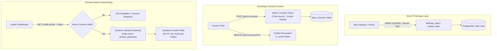
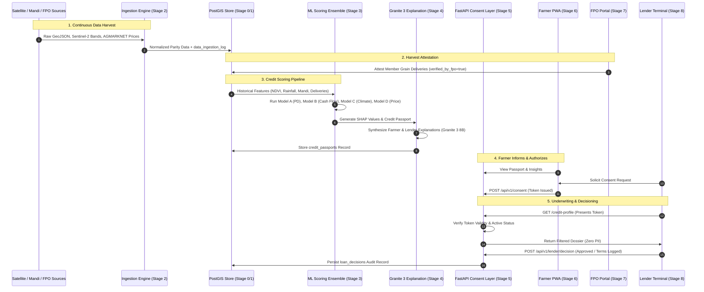

# Sanjeevani — End-to-End System Architecture Specification

An institutional-grade agricultural credit intelligence platform connecting smallholder farmers, Farmer Producer Organizations (FPOs), and institutional agricultural lenders (Public Sector Banks, Regional Rural Banks, MFIs, and NBFCs) through satellite remote sensing, alternative agronomic data, machine learning credit scoring, and cryptographic, farmer-sovereign consent.

---

## 1. System Topology & Architectural Overview

```
[ SATELLITE REMOTE SENSING ]    [ APMC MANDI FEEDS ]    [ PMFBY INSURANCE ]    [ FPO ERP & HARVEST LOGS ]    [ STATE LAND RECORDS ]
    Sentinel-2 L2A (10m)          AGMARKNET Modal Rates     Govt Crop Insurance       Verified Deliveries          GeoJSON Cadastral
         │                              │                         │                         │                            │
         └──────────────────────────────┴────────────┬────────────┴─────────────────────────┴────────────────────────────┘
                                                     │
                                                     ▼
                                      ┌──────────────────────────────┐
                                      │   STAGE 2 INGESTION TIER     │
                                      │ • LandGISIngestor            │
                                      │ • RemoteSensingIngestor      │
                                      │ • AgmarknetIngestor          │
                                      │ • PMFBYIngestor              │
                                      │ • FPOERPIngestor             │
                                      │ • IngestionFreshnessEngine   │
                                      └──────────────┬───────────────┘
                                                     │
                                                     ▼
                                      ┌──────────────────────────────┐
                                      │  STAGE 0/1 POSTGIS DATA LAKE │
                                      │ • PostGIS 3.4 Spatial Indices│
                                      │ • Zero-PII Aadhaar HMAC Hash │
                                      │ • data_ingestion_log Audit   │
                                      └──────────────┬───────────────┘
                                                     │
                                                     ▼
                                      ┌──────────────────────────────┐
                                      │   STAGE 3 ML SCORING CORE    │
                                      │ • Model A: Default Prob (PD) │
                                      │ • Model B: Cash Flow Bounds  │
                                      │ • Model C: Climate Stress    │
                                      │ • Model D: Mandi Revenue     │
                                      │ • TreeSHAP Attribution       │
                                      └──────────────┬───────────────┘
                                                     │
                                                     ▼
                                      ┌──────────────────────────────┐
                                      │ STAGE 4 EXPLANATION LAYER    │
                                      │ • IBM Granite 3 8B / OpenAI  │
                                      │ • Farmer vs Lender Audiences │
                                      │ • Non-Interference Invariant │
                                      └──────────────┬───────────────┘
                                                     │
                                                     ▼
                                      ┌──────────────────────────────┐
                                      │  STAGE 5 CONSENT & REST API  │
                                      │ • Time-bound HMAC Token      │
                                      │ • Dynamic Attribute Filter   │
                                      │ • /health, /ready, Logging   │
                                      └──────────────┬───────────────┘
                                                     │
                        ┌────────────────────────────┼────────────────────────────┐
                        ▼                            ▼                            ▼
              ┌──────────────────┐         ┌──────────────────┐         ┌──────────────────┐
              │ STAGE 6: FARMER  │         │   STAGE 7: FPO   │         │ STAGE 8: LENDER  │
              │       PWA        │         │ COOPERATIVE HUB  │         │    TERMINAL      │
              │ • 5 PWA Screens  │         │ • 4 Admin Views  │         │ • 4 Fintech Views│
              │ • Offline Cache  │         │ • Attestation Log│         │ • Consent Guard  │
              │ • EN / HI / MR   │         │ • Group Dossier  │         │ • Decision Audit │
              │ • Port 3000      │         │ • Port 3001      │         │ • Port 3002      │
              └──────────────────┘         └──────────────────┘         └──────────────────┘
```

---

## 2. Component Mapping Matrix (Stages 0 through 8 & Pilot Infrastructure)

| Stage | Subsystem | Key Files & Modules | Core Responsibility & Architectural Role |
| :--- | :--- | :--- | :--- |
| **Stage 0 & 1** | **Data Architecture & PostGIS Data Lake** | `backend/alembic/versions/`<br>`backend/app/models/`<br>`backend/app/db/session.py` | Relational & spatial schema across 12 entities. WGS84 GeoJSON polygons with GiST spatial indexing; Zero-PII salt-hashed Aadhaar identifiers; immutable `data_ingestion_log`. |
| **Stage 2** | **Multi-Source Ingestion Engine** | `backend/app/ingestion/`<br>`backend/app/services/ingestion_orchestrator.py`<br>`backend/app/services/ingestion_logger.py` | 5 automated ETL connectors (`LAND_GIS`, `REMOTE_SENSING`, `AGMARKNET`, `PMFBY`, `FPO_ERP`). Cloud-mask filtering, NDVI calculations, FPO harvest attestation tracking, telemetry logging. |
| **Stage 3** | **Machine Learning Credit Scoring Core** | `ml-engine/models/`<br>`backend/app/services/scoring_service.py`<br>`backend/app/services/passport_orchestrator.py` | 4-Model ensemble: Model A (Credit Risk / PD via LightGBM), Model B (Cash Flow Realization & Safe Limit), Model C (Climate Risk Index), Model D (Mandi Price Volatility & Revenue). TreeSHAP feature importances. |
| **Stage 4** | **Plain-Language Explanation Layer** | `backend/app/services/explanation_service.py`<br>`backend/app/core/llm_client.py` | LLM-driven post-scoring explainer (IBM Granite 3 8B Instruct / GPT-4o / Rule-Based). Distinct personas: Farmer (actionable & encouraging) and Lender (analytical & risk-weighted). Non-interference invariant. |
| **Stage 5** | **FastAPI REST Layer & Sovereign Consent Backbone** | `backend/app/api/v1/endpoints/consent.py`<br>`backend/app/api/v1/endpoints/credit.py`<br>`backend/app/api/v1/endpoints/passport.py` | HMAC SHA-256 time-bound consent tokens. Strict dynamic attribute masking: lenders receive only authorized data fields. Zero PII exposure. Instant farmer revocation. |
| **Stage 6** | **Farmer-Facing Progressive Web App** | `frontend-farmer-pwa/`<br>`frontend-farmer-pwa/src/screens/`<br>`frontend-farmer-pwa/public/sw.js` | Mobile-first PWA (Port 3000). Service Worker offline caching for rural belts. Multilingual (EN/HI/MR). 5 screens: Dashboard Gauge, Insights, Consent Manager, Document Upload, FPO Standing. |
| **Stage 7** | **FPO Cooperative Portal** | `frontend-fpo-portal/`<br>`frontend-fpo-portal/src/screens/`<br>`frontend-fpo-portal/src/services/` | Cooperative management portal (Port 3001). 4 screens: Portfolio Risk Mix, Member Directory, Production Attestation Workflow (`verified_by_fpo=true`), Group Financing Negotiation Dossier. |
| **Stage 8** | **Institutional Lender Dashboard** | `frontend-lender-dashboard/`<br>`frontend-lender-dashboard/src/screens/`<br>`frontend-lender-dashboard/src/services/` | Bank/NBFC underwriting terminal (Port 3002). 4 screens: Consent-Gated Farmer Search, Comprehensive Agronomic Dossier (Models B/C/D), Consent Solicitation Flow, Loan Decision Ledger. |
| **Pilot Ops** | **Health, Telemetry & Onboarding CLI** | `backend/app/api/v1/endpoints/health.py`<br>`backend/app/core/logging_config.py`<br>`scripts/pilot_onboard.py`<br>`docs/pilot_deployment.md` | Liveness (`/health`) and Readiness (`/ready`) probes; real-time Ingestion Freshness Health Dashboard; Structured JSON Logging with request tracing; Single-command FPO onboarding CLI; Docker Compose stack. |

---

## 3. Core Architectural Invariants & Security Principles



### 1. Zero-PII Data Lake Invariant
- **Aadhaar & Contact Cryptography**: Raw 12-digit Aadhaar numbers and mobile numbers are never written to disk or logs. They are normalized and salted using `AADHAAR_HMAC_SALT` via HMAC-SHA256.
- **Anonymized Spatial Records**: Cadastral polygons (`land_parcels`) are linked to synthetic UUIDs. GPS boundaries are verified against satellite indices without retaining land title owner names.

### 2. Sovereign Consent Backbone
- **Granular Scoping**: Consent is attribute-specific (`shared_attributes = ["agritrust_score", "satellite_metrics", "cash_flow"]`).
- **Time-Bound Validity**: Every consent token carries an explicit `expires_at` timestamp. Requests past expiration fail automatically.
- **Unilateral Revocation**: The farmer can revoke consent instantly via `DELETE /api/v1/consent/{consent_id}` (`is_active = false`, `revoked_at = now()`).
- **Dynamic Masking Middleware**: The `/api/v1/farmer/{farmer_id}/credit-profile` endpoint validates the token against `data_consents`, extracts authorized attributes, and strips all other data keys from the JSON response before serialization.

### 3. Non-Interference Invariant of the Explanation Layer
- The plain-language explanation service (`Stage 4`) is an unprivileged consumer of the scoring output.
- It takes as input `credit_passport` and `shap_explainability`.
- **Architectural Guarantee**: Under no circumstances can the explanation service alter, override, or back-propagate into `agritrust_score`, `safe_credit_min`, `safe_credit_max`, or `risk_score`.

### 4. Multi-Tenant Cooperative Isolation
- FPO administrators can only query and attest production logs for farmers enrolled under their explicit `fpo_id`.
- Cross-tenant queries are rejected at the database query level.

---

## 4. End-to-End Data Flow Architecture



---

## 5. Subsystem Technical Specifications

### A. Stage 0 & 1: PostGIS Database & Data Lake
- **Engine**: PostgreSQL 16 with PostGIS 3.4 extensions.
- **Spatial Geometry**: WGS84 (`SRID 4326`) Polygons and Centroid Points indexed via Spatial GiST indexes (`CREATE INDEX idx_parcels_geom ON land_parcels USING GIST (geometry);`).
- **Core Tables**:
  - `farmers`: Anonymized farmer profiles (`id`, `aadhaar_hash`, `mobile_hash`, `fpo_id`, `district`, `state`).
  - `land_parcels`: Spatial cadastre boundaries (`id`, `farmer_id`, `survey_number`, `area_acres`, `geometry`, `centroid`, `irrigation_type`, `soil_type`).
  - `crop_cycles`: Sowing to harvest records (`id`, `parcel_id`, `crop_name`, `season`, `actual_yield_kg`).
  - `satellite_features`: Temporal remote sensing timeseries (`ndvi_mean`, `ndwi_mean`, `evi_mean`, `cloud_cover_pct`).
  - `mandi_prices`: APMC market rates (`commodity`, `market_center`, `arrival_date`, `modal_price_per_quintal`).
  - `fpo_transactions`: Cooperative receipts with boolean `verified_by_fpo` attestation flags.
  - `credit_passports`: Master credit records (`agritrust_score` [300–900], `safe_credit_min/max`, `data_confidence`, `risk_score`).
  - `data_consents`: Consent ledger (`token_hash`, `shared_attributes`, `expires_at`, `is_active`, `revoked_at`).
  - `loan_decisions`: Underwriting outcomes (`decision`, `approved_amount`, `tenure_months`, `recorded_at`).
  - `data_ingestion_log`: Operations ledger (`source`, `records_ingested`, `status`, `execution_time_seconds`).

### B. Stage 2: Data Ingestion & Transformation Connectors
- **Connectors**:
  - `LandGISIngestor`: Parses GeoJSON/Shapefiles, validates coordinate bounds, calculates spherical polygon area, handles survey subdivisions.
  - `RemoteSensingIngestor`: Processes Sentinel-2 L2A BOA reflectance tiles, extracts 10m bands (B4-Red, B8-NIR, B11-SWIR), computes NDVI/NDWI, screens cloud contamination.
  - `AgmarknetIngestor`: Scrapes/ingests daily APMC mandi wholesale transactions, computes 30-day moving averages and seasonal price volatility.
  - `PMFBYIngestor`: Imports Pradhan Mantri Fasal Bima Yojana policy records, claim compensation history, and crop loss assessment ratios.
  - `FPOERPIngestor`: Ingests member crop weighbridge deliveries, seed/fertilizer input advances, and cooperative sales settlements.
- **Ingestion Telemetry & Freshness Engine**:
  - Evaluates ingestion freshness against source SLAs (e.g. Satellite: 5 days, Mandi: 24 hours, Land: 90 days).
  - Calculates a weighted `platform_data_confidence` metric:
    $$\text{Confidence} = 0.35 \times C_{\text{Land}} + 0.25 \times C_{\text{Satellite}} + 0.15 \times C_{\text{Mandi}} + 0.10 \times C_{\text{PMFBY}} + 0.15 \times C_{\text{FPO}}$$
  - Surfaced via JSON endpoint (`/api/v1/health/ingestion-freshness`) and Admin UI (`/api/v1/health/ingestion-dashboard`).

### C. Stage 3: ML Scoring Ensemble & Scoring Core
- **Model A (Agricultural Credit Risk & Default Probability)**:
  - Algorithm: LightGBM / XGBoost Gradient Boosted Decision Trees.
  - Target: Binary 12-month Probability of Default (PD).
  - Features: 3-season NDVI slope, verified FPO delivery ratio, historical yield vs district average, input purchase consistency.
  - Scaling: Maps PD to standardized Indian bureau range (300 to 900) via log-odds calibration:
    $$\text{Score} = \text{Offset} - \text{Factor} \times \ln\left(\frac{\text{PD}}{1 - \text{PD}}\right)$$
  - Explainability: TreeSHAP computes exact per-feature attributions.
- **Model B (Cash Flow Realization & Safe Borrowing Limits)**:
  - Calculates verified gross crop revenue minus simulated input cost and household expense buffers.
  - Sets `safe_credit_min` (seasonal working capital) and `safe_credit_max` (capped at 50% of expected net disposable income).
- **Model C (Climate Stress & Vulnerability Index)**:
  - Satellite moisture deficit indices, monsoon onset deviation, and flood/drought recurrence risks.
  - Outputs risk classification: `Low`, `Moderate`, `High`, `Critical`.
- **Model D (Mandi Price Volatility & Revenue Forecaster)**:
  - Monte Carlo distribution fitting on AGMARKNET price timeseries.
  - Generates revenue realization percentiles: `Optimistic (P90)`, `Base (P50)`, `Downside (P10)`.
- **Credit Passport Orchestrator**:
  - Merges Models A, B, C, D into a unified cryptographic JSON passport payload.

### D. Stage 4: Plain-Language Explanation Layer
- **Architecture**: Decoupled natural language generation micro-layer.
- **Model Support**: IBM Granite 3 8B Instruct (specialized for factual, domain-specific instruction), OpenAI GPT-4o, or Rule-Based Deterministic Fallback (`LLM_PROVIDER=granite|openai|mock`).
- **Dual Audience Synthesis**:
  - **Farmer Mode**: Positive, low-jargon, actionable recommendations (e.g. "Sell through your FPO to build verified history", "Upload mandi receipt").
  - **Lender Mode**: Quantitative credit committee framing with risk mitigating factors (e.g. "Strong NDVI stability offset by moderate APMC price volatility").
- **Safety Invariant**: Strict read-only contract. Cannot mutate numerical score outputs.

### E. Stage 5: FastAPI REST Layer & Sovereign Consent Backbone
- **Framework**: FastAPI (Python 3.13 / ASGI Uvicorn).
- **Security Protocols**:
  - HMAC SHA-256 consent token verification on all lender-facing data endpoints.
  - Dynamic JSON response filtering stripping all keys not present in `shared_attributes`.
  - Zero PII transmission.
- **Observability**:
  - `GET /health`: Instant liveness check.
  - `GET /ready`: Readiness probe verifying PostgreSQL connection, PostGIS availability, ML model weights, and consent cache.
  - `backend/app/core/logging_config.py`: High-performance JSON logging emitting request IDs, latencies, HTTP status codes, and user agents.

### F. Stage 6: Farmer PWA (`/frontend-farmer-pwa`)
- **Technology**: React 18, TypeScript, Vite, TailwindCSS / Custom Tokens.
- **Offline Reliability**: Service Worker (`sw.js`) precaching static assets and offline cache fallback for rural areas.
- **Localization**: Full internationalization for English (EN), Hindi (HI), and Marathi (MR).
- **Core Screens**:
  1. **Dashboard**: Credit score circular gauge (0–100 scale), safe borrowing range, profile completeness bar.
  2. **Insights**: Plain-language explanations of score drivers with actionable step-by-step guidance.
  3. **Consent Manager**: Real-time listing of active, expired, and revoked consents with instant toggle revocation.
  4. **Data Upload**: Mobile capture forms for crop cycle progress, PMFBY insurance claims, and mandi receipts.
  5. **FPO Membership**: Verification status with local cooperative, total attested deliveries, and community standing.

### G. Stage 7: FPO Cooperative Portal (`/frontend-fpo-portal`)
- **Technology**: React 18, TypeScript, Vite, Enterprise Dashboard Layout.
- **Multi-Tenant Security**: Enforces `fpo_id` scope isolation across all data queries.
- **Core Screens**:
  1. **Portfolio Overview**: Member score distribution histograms, cumulative verified crop volume, risk category breakdown.
  2. **Member Management**: Comprehensive roster of member farmers, score tiers, and data completeness alerts.
  3. **Production Attestation**: Digital workflow to inspect self-reported member harvest deliveries and sign official FPO attestations (`verified_by_fpo = true`).
  4. **Bulk Financing Negotiation View**: Consolidated portfolio risk summaries to present to banks for negotiated low-interest group loans.

### H. Stage 8: Institutional Lender Terminal (`/frontend-lender-dashboard`)
- **Technology**: React 18, TypeScript, Vite, Financial Terminal UI.
- **Consent-Gated Data Access**: Prevents search, view, or underwriting of any farmer lacking an active, unexpired consent token.
- **Core Screens**:
  1. **Portfolio Search**: Search and filter farmers by crop, district, score tier, and risk level — strictly restricted to consented farmers.
  2. **Underwriting Dossier**: Detailed financial dossier containing Model B cash flow curves, Model D AGMARKNET price scenarios (Base/Optimistic/Downside), Model C climate stress indices, and Stage 4 lender-facing explanation.
  3. **Consent Request Flow**: Interface to solicit consent tokens from specific farmers via their mobile phone / Aadhaar hash.
  4. **Loan Decision Ledger**: Audit trail of credit approvals, declines, conditional offers, approved loan amounts, tenures, and interest rates.

---

## 6. Pilot Rollout & Infrastructure Operations

### A. Docker Compose Topology
The pilot system is deployed via a multi-container Docker Compose architecture (`docker-compose.yml`):
- `postgres`: PostgreSQL 16 with PostGIS 3.4 (`sanjeevani-postgres`).
- `redis`: Redis 7 alpine (`sanjeevani-redis`).
- `api`: FastAPI ASGI application running on port 8000 (`sanjeevani-api`).
- `ml-worker`: Celery / Python background worker (`sanjeevani-ml-worker`).
- `farmer-pwa`: Vite preview server on port 3000 (`sanjeevani-farmer-pwa`).
- `fpo-portal`: Vite preview server on port 3001 (`sanjeevani-fpo-portal`).
- `lender-dashboard`: Vite preview server on port 3002 (`sanjeevani-lender-dashboard`).

### B. Single-FPO Pilot Onboarding CLI
The pilot onboarding workflow is executed via `scripts/pilot_onboard.py`:
```bash
python scripts/pilot_onboard.py --fpo-code NSK-FPO-01 --district Nashik --num-farmers 150 --state Maharashtra
```
- Automatically generates cadastral land parcel GeoJSON boundaries with valid WGS84 coordinates.
- Creates farmer profiles and crop cycle histories (e.g. Onion, Soybean, Pomegranate).
- Simulates initial satellite NDVI, mandi price, and FPO delivery features.
- Executes the scoring engine to produce baseline credit passports for all 150 farmers.

### C. Cloud Scaling Roadmap
- **Database**: Transition from local PostGIS container to AWS RDS / Aurora PostgreSQL with PostGIS or Google Cloud SQL for PostgreSQL with high-availability read replicas.
- **Containers**: Transition Docker Compose to AWS EKS or GCP GKE with horizontal pod autoscaling (KEDA) driven by API request rates and ML queue depth.
- **Secrets Management**: Transition `.env` secrets (`SECRET_KEY`, `AADHAAR_HMAC_SALT`) to AWS Secrets Manager or HashiCorp Vault.
- **Object Storage**: Offload satellite GeoTIFF tiles and drone imagery to AWS S3 or GCP Cloud Storage with pre-signed upload URLs.
