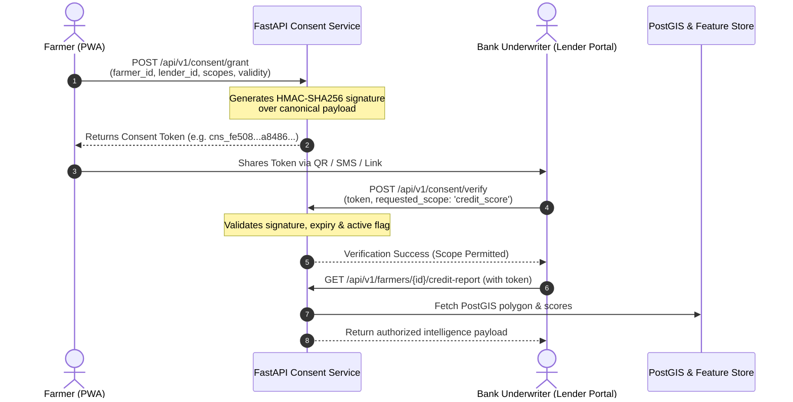

# Stage 5 Consent Architecture — Cryptographic Token Protocol

## 1. Design Motivation
Agricultural credit underwriting often involves sensitive multi-source farmer data:
- Land ownership & survey numbers
- High-resolution satellite crop health (NDVI/NDWI)
- FPO harvest delivery quantities and Mandi bank transactions

Under Stage 5 architecture, **farmers maintain sovereign control over their data footprint**. Lenders cannot query a farmer's credit intelligence without presenting a valid, unexpired, and farmer-authorized **Consent Token**.

---

## 2. Consent Token Lifecycle



---

## 3. Scopes & Permissions

| Scope Identifier | Data Permitted |
|---|---|
| `credit_score` | Overall credit score (300-900), rating tier, and default risk probability |
| `satellite_ndvi` | Sentinel-2 NDVI canopy index, moisture index, and anomaly flags |
| `yield_forecast` | ARIMA seasonal yield forecast and harvest volume history |
| `land_boundaries` | Raw PostGIS Survey Polygon coordinates and centroid coordinates |
| `bank_statements` | Financial transaction logs from verified Mandi sales |

---

## 4. Cryptographic Signature Formulation

The consent signature is computed via:
```python
signature = HMAC_SHA256(
    key = CONSENT_SECRET_KEY,
    message = JSON_CANONICAL({
        "farmer_id": farmer_id,
        "lender_entity_id": lender_entity_id,
        "scope": sorted(scope),
        "valid_from": valid_from_iso,
        "valid_until": valid_until_iso
    })
)
```
This guarantees non-repudiation and tamper prevention.
