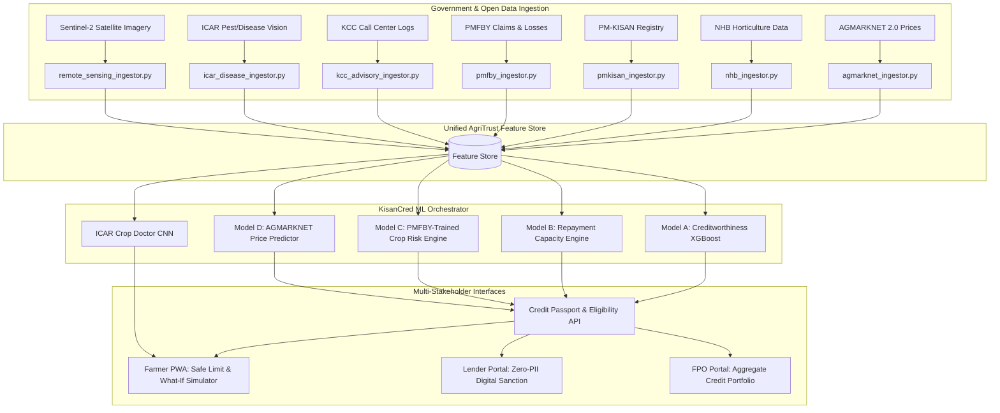

# Sanjeevani (AgriTrust) — Public & Government Agricultural Dataset Architecture & Mapping Report

**Version:** 2.0 (Updated 2026)  
**System:** Sanjeevani / AgriTrust Agricultural Credit & Risk Intelligence Platform  
**Target Domain:** Indian Agritech, Digital Public Infrastructure (DPI), NABARD/RBI/KCC Compliance  

---

## 1. Executive Summary

Sanjeevani leverages open public data, sovereign agricultural datasets, and satellite remote sensing to power explainable credit underwriting, risk assessment, and market intelligence for Indian smallholders and FPOs. 

This document outlines the **architecture, schema ingestion pipelines, ML model mapping, and data flow** for the **6 foundational Indian Government agricultural datasets**:
1. **AGMARKNET 2.0** (Agricultural Marketing Information Network — Ministry of Agriculture)
2. **National Horticulture Board (NHB)** Area & Production Statistics
3. **PM-KISAN** Village- & Gender-wise Beneficiary Dataset (Data.gov.in)
4. **PMFBY** (Pradhan Mantri Fasal Bima Yojana) Historical Claims & Crop Loss Dataset
5. **Kisan Call Centre (KCC)** Query & Agro-Advisory Logs
6. **ICAR** Crop Pest & Plant Disease Annotated Image Dataset

---

## 2. Dataset Ingestion & Architecture Mapping Matrix

| # | Dataset Name | Source / Portal | Primary Attributes | Ingestion Layer / Connector | ML Engine Model / Consumer | Platform Output & Value |
|---|--------------|-----------------|--------------------|----------------------------|----------------------------|-------------------------|
| **1** | **AGMARKNET 2.0** | agmarknet.gov.in / Data.gov.in | Commodity, APMC Mandi, Variety, Grade, Modal Price (₹/Qtl), Arrivals (MT), Arrival Date | [`agmarknet_ingestor.py`](file:///c:/Users/Shivam%20Ray/Desktop/IBM/backend/app/ingestion/agmarknet_ingestor.py) | **Model D** (`MarketPricePredictor` ARIMA + baseline median) | Real-time harvest revenue realization scenarios, price volatility bounds for loan sizing. |
| **2** | **National Horticulture Board (NHB)** | nhb.gov.in | State/District crop acreage, yield per hectare, production volume, multi-year trends | [`nhb_ingestor.py`](file:///c:/Users/Shivam%20Ray/Desktop/IBM/backend/app/ingestion/nhb_ingestor.py) | **Model B** (`RepaymentCapacityEngine`) & Feature Store | District-level benchmark production yield; validates farmer declared acreage vs district averages. |
| **3** | **PM-KISAN Beneficiary Data** | data.gov.in (Updated Sep 2026) | District, Block, Village, Gender, Beneficiary Counts, Installment Disbursement Status | [`pmkisan_ingestor.py`](file:///c:/Users/Shivam%20Ray/Desktop/IBM/backend/app/ingestion/pmkisan_ingestor.py) | **Identity & Land Verification Layer** | Sovereign identity grounding; validates smallholder status and basic DBT income flow. |
| **4** | **PMFBY Crop Insurance & Claims** | pmfby.gov.in / Data.gov.in | Crop season, Insured Area, Sum Insured, Claim Payout Ratio, Notified Unit Loss Frequency | [`pmfby_ingestor.py`](file:///c:/Users/Shivam%20Ray/Desktop/IBM/backend/app/ingestion/pmfby_ingestor.py) | **Model C** (`CropRegionRiskEngine` Random Forest) | Hyper-local climate & drought vulnerability scoring; default probability under climate distress. |
| **5** | **Kisan Call Centre (KCC)** | data.gov.in / DAC&FW | Query Type (Weed/Pest/Weather/Fertilizer), Crop, Sector, District, Season, Advisory Text | [`kcc_advisory_ingestor.py`](file:///c:/Users/Shivam%20Ray/Desktop/IBM/backend/app/ingestion/kcc_advisory_ingestor.py) | **NLP / Agro-Advisory Engine** & Early Warning | Early alert generation for regional pest outbreaks; contextual agro-advisories on Farmer PWA. |
| **6** | **ICAR Crop Pest & Disease Images** | data.gov.in / ICAR-IASRI | Annotated leaf/crop images, Disease Class, Pest Severity, Crop Stage, Geo-location | [`icar_disease_ingestor.py`](file:///c:/Users/Shivam%20Ray/Desktop/IBM/backend/app/ingestion/icar_disease_ingestor.py) | **Computer Vision Diagnostic CNN** (MobileNetV3) | In-field offline/online leaf scan disease diagnosis on Farmer PWA; dynamic yield haircut adjustment. |

---

## 3. Deep-Dive: Dataset Specifications & Ingestion Logic

### 3.1. AGMARKNET 2.0 (Commodity Prices & Mandi Arrivals)
- **API Endpoint:** `https://api.data.gov.in/resource/9ef84268-d588-465a-a308-a864a43d0070`
- **Cadence:** Daily scheduled batch job via Celery worker (`sync_daily_market_prices`).
- **Data Transformation:**
  $$\text{Expected Crop Revenue} = \text{Land Area (Acres)} \times \text{Expected Yield (Qtl/Acre)} \times \text{Modal Price (₹/Qtl)}$$
- **Usage in Sanjeevani:** Powers the **Price Realization Scenario Simulator** on Lender Dashboard (Optimistic, Expected, Stress-Tested prices).

### 3.2. National Horticulture Board (NHB)
- **Granularity:** State $\rightarrow$ District $\rightarrow$ Crop species (e.g., Nashik Grapes, Ratnagiri Alphonso Mango, Solapur Pomegranate).
- **Usage in Sanjeevani:** 
  - Standardizes the **Scale of Finance (SoF)** per acre for high-value horticulture crops.
  - Prevents over-leveraging by establishing district-level historical yield caps.

### 3.3. PM-KISAN Sovereign DBT Ingestion
- **Granularity:** Village-level aggregation with gender-disaggregated penetration metrics.
- **Verification Rule:**
  - If farmer Aadhaar/Phone matches verified PM-KISAN installment registry $\rightarrow$ **+40 Bonus AgriTrust Credit Score points**.
  - Adds ₹6,000/year guaranteed sovereign liquidity to debt-service coverage ratio (DSCR).

### 3.4. PMFBY (Crop Risk & Historic Claims Ratio)
- **Risk Indicator:** $\text{Loss Cost Ratio (LCR)} = \frac{\text{Total Claims Paid (₹)}}{\text{Total Sum Insured (₹)}}$
- **Integration with Sentinel-2 NDVI:**
  - If regional PMFBY claims frequency > 35% in past 5 years and current Sentinel-2 NDVI < 0.45 $\rightarrow$ Triggers **Climate Stress Buffer** (10-15% loan reserve requirement).

### 3.5. Kisan Call Centre (KCC Advisory Logs)
- **Processing:** Vectorized semantic search over farmer inquiries.
- **Trigger Condition:** Sudden spike (>2.5 standard deviations) in pest-related queries in a target PIN code triggers push alerts in Farmer PWA in Hindi/Tamil/Punjabi.

### 3.6. ICAR Crop Disease & Pest Image Dataset
- **Model Architecture:** Lightweight Convolutional Neural Network (Transfer learning via MobileNetV3 / EfficientNet-Lite).
- **Target Classes:** Wheat Rust (Stripe/Brown), Tomato Early Blight, Cotton Pink Bollworm, Paddy Blast.
- **Impact on Underwriting:** Real-time diagnosis automatically updates **NDVI vegetative adjustment factor** in [`CreditEligibilityResponse`](file:///c:/Users/Shivam%20Ray/Desktop/IBM/backend/app/schemas/credit.py).

---

## 4. End-to-End Multi-Model Architecture Flow

---

## 5. Summary of Compliance & Open Data Governance

- **DPDP Act (Digital Personal Data Protection Act 2023):** Zero-PII transmission across lender endpoints with cryptographic consent tokens.
- **NABARD / KCC Guidelines:** Automated adherence to district-level Scale of Finance norms.
- **Data Refresh SLA:**
  - AGMARKNET Mandi prices: Daily at 18:00 IST.
  - Sentinel-2 Remote Sensing: 5-day orbital revisit cycle.
  - NHB & PMFBY statistics: Seasonal/Quarterly batch sync.
