# KisanCred / AgriTrust — Database Schema & Entity-Relationship (ER) Diagram

This document specifies the complete PostgreSQL + PostGIS spatial and relational schema for the KisanCred / AgriTrust platform.

---

## 1. Mermaid Entity-Relationship Diagram

```mermaid
erDiagram
    FPOS ||--o{ FARMERS : "aggregates (0..N)"
    FARMERS ||--o{ LAND_PARCELS : "owns (1..N)"
    FARMERS ||--o{ CROP_CYCLES : "cultivates (1..N)"
    LAND_PARCELS ||--o{ CROP_CYCLES : "hosts (0..N)"
    FARMERS ||--o{ MARKET_TRANSACTIONS : "sells (0..N)"
    FARMERS ||--o{ CREDIT_PASSPORTS : "evaluated_as (0..N)"
    FARMERS ||--o{ DATA_CONSENTS : "grants (0..N)"
    LENDERS ||--o{ DATA_CONSENTS : "receives (0..N)"
    FARMERS ||--o{ INSURANCE_RECORDS : "insured_under (0..N)"

    FPOS {
        UUID fpo_id PK "UUID default uuid_generate_v4()"
        VARCHAR fpo_name "Name of Farmer Producer Company"
        VARCHAR registration_number UK "Official MCA / Co-op Reg #"
        VARCHAR region "District and State"
        INTEGER member_count "Total registered farmer members"
        TIMESTAMPTZ created_at "Audit timestamp"
        TIMESTAMPTZ updated_at "Audit timestamp"
    }

    LENDERS {
        UUID lender_id PK "UUID default uuid_generate_v4()"
        VARCHAR institution_name "Bank / NBFC / MFI Name"
        VARCHAR api_key_hash "SHA-256 hash of API credential"
        VARCHAR tier "Tier-1 Public Bank, NBFC, MFI"
        TIMESTAMPTZ created_at "Audit timestamp"
        TIMESTAMPTZ updated_at "Audit timestamp"
    }

    FARMERS {
        UUID farmer_id PK "UUID default uuid_generate_v4()"
        VARCHAR aadhaar_hash UK "SHA-256 One-Way Hash (Raw Aadhaar Never Stored)"
        VARCHAR full_name "Legal name of farmer"
        VARCHAR mobile_number UK "10-digit mobile number"
        UUID fpo_id FK "References fpos.fpo_id ON DELETE SET NULL"
        BOOLEAN is_active "Soft-delete flag (Default TRUE)"
        BOOLEAN is_archived "Audit archival flag (Default FALSE)"
        TIMESTAMPTZ created_at "Registration timestamp"
        TIMESTAMPTZ updated_at "Profile update timestamp"
    }

    LAND_PARCELS {
        UUID parcel_id PK "UUID default uuid_generate_v4()"
        UUID farmer_id FK "References farmers.farmer_id ON DELETE RESTRICT"
        VARCHAR survey_number "Land revenue 7/12 survey number"
        NUMERIC acreage "Plot size in acres (precision 10,2)"
        VARCHAR soil_type "Black Cotton, Clay Loam, etc."
        VARCHAR irrigation_source "Canal Drip, Borewell, Solar Pump"
        GEOMETRY boundary_polygon "GEOMETRY(Polygon, 4326) with GIST Index"
        TIMESTAMPTZ created_at "Creation timestamp"
        TIMESTAMPTZ updated_at "Update timestamp"
    }

    CROP_CYCLES {
        UUID cycle_id PK "UUID default uuid_generate_v4()"
        UUID farmer_id FK "References farmers.farmer_id ON DELETE RESTRICT"
        UUID parcel_id FK "References land_parcels.parcel_id ON DELETE RESTRICT"
        VARCHAR crop_name "Crop variety (e.g. Thompson Grapes, Red Onion)"
        VARCHAR season "Season (e.g. Kharif 2025, Rabi 2025-26)"
        NUMERIC expected_yield "Projected yield in quintals/acre"
        NUMERIC actual_yield "Harvested yield in quintals/acre"
        DATE sown_date "Date of planting / sowing"
        DATE harvest_date "Date of harvest completion"
        TIMESTAMPTZ created_at "Creation timestamp"
        TIMESTAMPTZ updated_at "Update timestamp"
    }

    MARKET_TRANSACTIONS {
        UUID transaction_id PK "UUID default uuid_generate_v4()"
        UUID farmer_id FK "References farmers.farmer_id ON DELETE RESTRICT"
        VARCHAR crop_name "Crop sold at Mandi"
        NUMERIC quantity_sold "Total weight in quintals"
        NUMERIC realization_price "Realized price in INR per quintal"
        VARCHAR mandi_name "APMC Mandi location (e.g. Lasalgaon APMC)"
        DATE transaction_date "Settlement date"
        BOOLEAN verified_by_fpo "True if weighed & verified by FPO scale"
        TIMESTAMPTZ created_at "Creation timestamp"
        TIMESTAMPTZ updated_at "Update timestamp"
    }

    CREDIT_PASSPORTS {
        UUID passport_id PK "UUID default uuid_generate_v4()"
        UUID farmer_id FK "References farmers.farmer_id ON DELETE RESTRICT"
        INTEGER agritrust_score "Score between 300 and 900"
        NUMERIC data_confidence "0.0000 to 1.0000 confidence metric"
        NUMERIC safe_credit_min "Floor recommended lending limit (INR)"
        NUMERIC safe_credit_max "Ceiling recommended lending limit (INR)"
        TIMESTAMPTZ generated_at "Generation timestamp"
        VARCHAR model_version "ML Ensemble version (e.g. v1.2.0-ensemble)"
    }

    DATA_CONSENTS {
        UUID consent_id PK "UUID default uuid_generate_v4()"
        UUID farmer_id FK "References farmers.farmer_id ON DELETE RESTRICT"
        UUID lender_id FK "References lenders.lender_id ON DELETE RESTRICT"
        VARCHAR_ARRAY shared_attributes "Permitted scopes (credit_score, ndvi, etc.)"
        TIMESTAMPTZ expires_at "Consent expiry timestamp"
        BOOLEAN is_active "Active validity flag"
        TIMESTAMPTZ granted_at "Consent grant timestamp"
        TIMESTAMPTZ revoked_at "Revocation timestamp (if revoked)"
    }

    INSURANCE_RECORDS {
        UUID insurance_id PK "UUID default uuid_generate_v4()"
        UUID farmer_id FK "References farmers.farmer_id ON DELETE RESTRICT"
        VARCHAR scheme_name "e.g. PM Fasal Bima Yojana (PMFBY)"
        VARCHAR season "Covered season (e.g. Kharif 2025)"
        NUMERIC premium_paid "Farmer share premium in INR"
        NUMERIC claim_amount "Settled or claimed indemnity in INR"
        VARCHAR claim_status "APPROVED, SETTLED, PENDING, REJECTED"
        TIMESTAMPTZ created_at "Creation timestamp"
        TIMESTAMPTZ updated_at "Update timestamp"
    }
```

---

## 2. Key Architectural Guarantees

### 1. Zero Plaintext Aadhaar Storage (One-Way Hashing)
- Raw 12-digit Aadhaar numbers are **never stored** in the database or written to disk.
- Enforced at the model validation layer (`Farmer.validate_and_enforce_aadhaar_hash`): any 12-digit input is deterministically hashed via SHA-256 into a 64-character hexadecimal digest before persistence.

### 2. Spatial Indexing & Geospatial Boundaries
- `land_parcels.boundary_polygon` uses PostGIS `GEOMETRY(Polygon, 4326)`.
- A Generalized Search Tree (**GIST**) index is established (`idx_land_parcels_boundary_polygon_gist`), enabling sub-millisecond bounding box intersection checks (`ST_Intersects`, `ST_Contains`) and spatial joins with satellite remote sensing rasters.

### 3. Non-Destructive Cascade & Soft Deletion
- Foreign keys from financial and operational tables (`market_transactions`, `crop_cycles`, `credit_passports`, `data_consents`, `insurance_records`) use `ON DELETE RESTRICT`.
- Deleting a farmer record cannot silently purge financial audit trails or past Mandi transactions.
- Farmers are retired through soft deletion (`is_active = FALSE`, `is_archived = TRUE`), preserving historical records for compliance.

---

## 3. Seed Fixture Summary

The database seed fixture (`backend/app/db/seed.py` and `infra/docker/seed-data.sql`) populates:
- **1 FPO**: *Sahyadri Farmers Producer Co. Ltd.* (Nashik, Maharashtra)
- **2 Lenders**: *State Bank of India (Agri-Business)* and *NABARD Financial Services*
- **25 Synthetic Farmers**: Authentic profiles with hashed Aadhaar and unique phone numbers
- **25 Land Parcels**: PostGIS closed Polygons with coordinates centered around Nashik, MH (SRID 4326)
- **25 Crop Cycles**: Seasonal harvest plans for Grapes, Onions, Pomegranates, Tomatoes, and Soybeans
- **50 Market Transactions**: APMC sales at Lasalgaon, Pimpalgaon Baswant, and Nashik Mandis
- **25 Credit Passports**: AgriTrust scores (620 to 825) with safe credit limits
- **25 Data Consents**: Stage 5 authorization grants with permission scopes
- **25 Insurance Records**: PMFBY claim records
